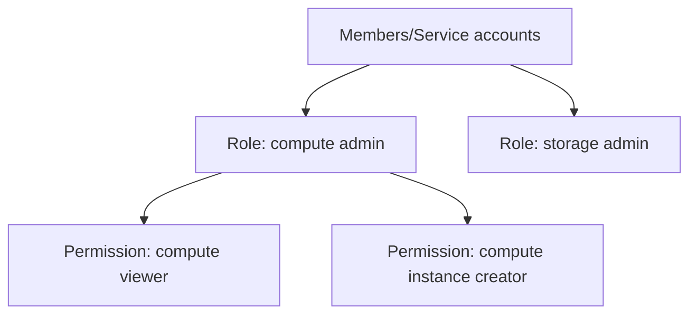

- [What is Cloud IAM?](#what-is-cloud-iam)
  - [Typical Identity management in Cloud](#typical-identity-management-in-cloud)
  - [GCP Cloud Identity and Accesss Management(IAM)](#gcp-cloud-identity-and-accesss-managementiam)
    - [Authentication](#authentication)
    - [Authorization](#authorization)
    - [Identities](#identities)
    - [Cloud IAM granular control](#cloud-iam-granular-control)
- [Cloud IAM with example](#cloud-iam-with-example)
- [Cloud IAM Roles](#cloud-iam-roles)
  - [3 Types of roles.](#3-types-of-roles)
    - [Basic Roles(or ```Primitive roles```) - Owner/Editor/Viewer](#basic-rolesor-primitive-roles---ownereditorviewer)
    - [Predefined Roles - Fine granted predefined by google.](#predefined-roles---fine-granted-predefined-by-google)
    - [Custom Roles](#custom-roles)
- [IAM: Member, Role and Policy](#iam-member-role-and-policy)
  - [Member](#member)
  - [Roles](#roles)
  - [Policy](#policy)
  - [IAM Policy](#iam-policy)
    - [IAM Policy Example](#iam-policy-example)
- [IAM console](#iam-console)
  - [Adding a new member](#adding-a-new-member)
  - [Policy Troubleshooter](#policy-troubleshooter)
- [IAM with command line](#iam-with-command-line)
  - [gcloud basic commands](#gcloud-basic-commands)
  - [gcloud projects commands](#gcloud-projects-commands)
    - [Adding IAM Policy binding](#adding-iam-policy-binding)
    - [Deleting IAM Policy binding](#deleting-iam-policy-binding)
  - [gcloud iam commands (Manage IAM service accounts and keys)](#gcloud-iam-commands-manage-iam-service-accounts-and-keys)
    - [gcloud iam command syntax](#gcloud-iam-command-syntax)
    - [Gcloud iam Important commands](#gcloud-iam-important-commands)
- [Service Accounts](#service-accounts)
  - [Service account types](#service-account-types)
    - [Default service account](#default-service-account)
    - [User managed](#user-managed)
    - [Google Managed Service accounts](#google-managed-service-accounts)
- [Creating example service account](#creating-example-service-account)
    - [Grant users access to service account](#grant-users-access-to-service-account)
    - [Create VM using the created service account](#create-vm-using-the-created-service-account)
- [Service Accounts use cases](#service-accounts-use-cases)
  - [VM \<-\> Cloud Storage](#vm---cloud-storage)
    - [Use Google Cloud-managed keys:](#use-google-cloud-managed-keys)
  - [On Prem \<-\> Cloud Storage(Long Lived)](#on-prem---cloud-storagelong-lived)
    - [2. Create Service account user managed key](#2-create-service-account-user-managed-key)
  - [On Prem \<-\> Google Cloud APIs(short lived)](#on-prem---google-cloud-apisshort-lived)
    - [Credential types for short lived premissions](#credential-types-for-short-lived-premissions)
    - [Examples:](#examples)
- [Service Accounts - Scenarios](#service-accounts---scenarios)
    - [Application on a VM wants to talk to a Cloud Storage Bucket](#application-on-a-vm-wants-to-talk-to-a-cloud-storage-bucket)
    - [Application on a VM wants to put a message on a pub/sub topic](#application-on-a-vm-wants-to-put-a-message-on-a-pubsub-topic)
    - [Is service account an identity or a resource](#is-service-account-an-identity-or-a-resource)
    - [VM Instance with default service account in Project A needs to access Cloud Storage bucket in Project B](#vm-instance-with-default-service-account-in-project-a-needs-to-access-cloud-storage-bucket-in-project-b)
- [Cloud Storage ACL(Access Control List)](#cloud-storage-aclaccess-control-list)
  - [What is ACL?](#what-is-acl)
  - [Access Control in Cloud Storage](#access-control-in-cloud-storage)
- [Cloud Storage - Signed URL](#cloud-storage---signed-url)
  - [Create a signed URL](#create-a-signed-url)
- [Exposing a Static Public Website on Cloud Storage](#exposing-a-static-public-website-on-cloud-storage)
# What is Cloud IAM?
## Typical Identity management in Cloud
- You have resources in the cloud(example: a virtual server, a database etc.)
- You've identities (human and non-human) that need to access those resources and perform actions.
  - For ex: Launch (stop, start or terminate) a virtual server
- How do you identify users in the cloud?
  - How do you configure resources they can access?
  - How can you configure what actions to allow?
- In GCP: Identity and Access Management (Cloud IAM) provides this service.
## GCP Cloud Identity and Accesss Management(IAM)
### Authentication
- Is it the right user?
### Authorization
- Do they have the right access?
### Identities 
can be:
- A GCP User(Google Account or Externally authentication user)
- A Group of GCP Users
- An Application running in GCP
- An application running in your data center
- UnAuthenticated users
### Cloud IAM granular control
- Provides very granular control
  - Limit a single user:
    - To perform single action
    - on a specific cloud resource
    - from a specific IP Address
    - during a specific time window

# Cloud IAM with example
- I want to provide access to manage a specific cloud storage bucket to a colleague of mine:
  - Important Generic Concepts:
    - ```Member```: My colleague
    - ```Resource```: Specific Cloud Storage bucket
    - ```Action```: Upload/Delete Objects
  - In Google Cloud IAM:
    - ```Roles```: A Set of permissions(to perform specific actions on specific resources)
      - Roles do not know about members. It is all about permissions!
    - How do you assign permissions to a member?
      - ```Policy```: You assign (or bind) a role to a member.
1. Choose a role with right permissions(Ex: Storage Object Admin)
2. Create a policy binding member(your friend) with role(permissions)
   - Policy = Member+Role
> IAM in AWS is very different from GCP(Forget AWS IAM & Start fresh)

# Cloud IAM Roles
- Roles are permissions:
  - Perform some set of actions on some set of resources
## 3 Types of roles.
### Basic Roles(or ```Primitive roles```) - Owner/Editor/Viewer
- ```Viewer(roles.viewer)``` - Read-only actions
- ```Editor(roles.editor)``` - Viewer + Edit actions
- ```Owner(roles.owner)``` - Editor + Manage Roles and Permissions + Billing
- Earliest Version: Created before IAM
- NOT RECOMMENDED: Don't use in production
### Predefined Roles - Fine granted predefined by google.
- Fine Granted roles predefined and managed by Google.
- Different roles for different purposes.
- Examples: Storage Admin, Storage Object Admin, Storage Object Viewer, Storage Object Creator
### Custom Roles
- When predefined roles are NOT sufficient, you can create your own custom roles.
- stages in custom roles:
  - Alpha
  - Beta
  - Generic
  - Disable

# IAM: Member, Role and Policy
## Member
- Who?
- Member is also called as Principal or Identity.
## Roles
- Permissions (what actions? What resources?)
## Policy
- Assign permissions to members
  - Map roles(what?), Members(Who?) and conditions(Which resources?, When?, From where?)
  - Remember: Permissions are NOT  directly assigned to Member
    - Permissions are represented by a Role
    - Member gets permissions through role
- A Role can have multiple permissions.
- You can assign multiple roles to a Member.



## IAM Policy
- Roles are assigned to users through IAM Policy documents
- Represented by a policy object.
  - Policy object has a list of bindings
  - A binding, binds a role to list of members.
- Member type is identified by prefix:
  - Example: user, serviceaccount, group or domain
### IAM Policy Example
```json
{
    "bindings":[
        {
            "role": "roles/storage.objectAdmin",
            "members":[
                "user:tushar@kubekode.org",
                "serviceAccount:myapp@appspot.gserviceaccount.com",
                "group:administrators@kubekode.org",
                "domain:google.com"
            ]
        },
        {
            "role": "roles/storage.objectViewer",
            "members":[
                "user:tushar@kubekode.org"
            ],
            "condition":{
                "title": "Limited time access",
                "description":"Only upto Feb 2022",
                "expression": "request.time < timestamp('2022-02-01T00:00:00.000Z')"
            }

        }
    ]
}
```

# IAM console 
## Adding a new member
- Go to IAM > IAM > Click on Add
- Add members(Email id, service account)
- Add roles for the members.
- We can edit permissions also.
## Policy Troubleshooter
- If somebody is not able to access something so we can troubleshoot the policy.
- Also we can see the policy bindings.

# IAM with command line
## gcloud basic commands
```sh
# decribe current project
gcloud compute project-info
# login to gcloud
gcloud auth login
# list authentication
gcloud auth list
# Revoke access credentials for an account
gcloud auth revoke
```

## gcloud projects commands
- Add IAM Policy binding
  - ```gcloud projects add-iam-policy-binding```
- Get IAM policy for a project
  - ```gcloud projects get-iam-policy PROJECT_ID```
- Removing IAM Policy binding
  - ```gcloud projects remove-iam-policy-binding```
- Set the IAM Policy(Overwrite the entire existing policy and set a new IAM Policy)
  - ```gcloud projects set-iam-policy```
- Deleting a project
  - ```gcloud projects delete```
### Adding IAM Policy binding
```sh
gcloud projects add-iam-policy-binding PROJECT_ID --member=user:tushar@kubekode.org --role=roles/storage.objectAdmin
```
### Deleting IAM Policy binding
```sh
gcloud projects remove-iam-policy-binding PROJECT_ID  --member=user:tushar@kubekode.org --role=roles/storage.objectAdmin
```

## gcloud iam commands (Manage IAM service accounts and keys)
### gcloud iam command syntax
```sh
gcloud iam GROUP | COMMAND [GCLOUD_WIDE_FLAG ...]
```
**GROUPs in gcloud iam command**
- policies
  - Manage IAM deny policies.
- roles
  - Create and manipulate roles.
- service-accounts
  - Create and manipulate service accounts.
- simulator
  - Understand how an IAM policy change could impact access before
  deploying the change.
- workforce-pools
  - Create and manage workforce pools.
- workload-identity-pools
  - Manage IAM workload identity pools.
**COMMANDs in gcloud iam command**
- list-grantable-roles
  - List IAM grantable roles for a resource.
- list-testable-permissions
  - List IAM testable permissions for a resource.

### Gcloud iam Important commands
- Desribe an IAM Role
  - ```gcloud iam roles describe```
- Create an iam role
  - ```gcloud iam roles create```
    - ```--project,--permissions,--stage```

```sh
# Using Yaml file
gcloud iam roles create ProjectUpdater --organization=12345 --file=role_file_path
# To create a custom role ProjectUpdater with flags, run:
gcloud iam roles create ProjectUpdater --project=myproject --title=ProjectUpdater --description="Have access to get and update the project" --permissions=resourcemanager.projects.get,resourcemanager.projects.update
```

- Copy IAM roles
  - ```gcloud iam roles copy```
    - ```--source=roles/storage.objectAdmin```, ```--destination=my.custom.role```, ```--dest-project=PROJECT_ID```

# Service Accounts
- Scenario: An Application on a VM needs access to cloud storage.
  - We don't want to use personal credentials to allow access.
- (RECOMMENDED) Use service accounts
  - Identified by an email address
    - ```id-compute@developer.gserviceaccount.com```
  - Doesn't have password.
    - Has a private/public RSA key-pairs
    - Can't login via browsers or cookies.
## Service account types
### Default service account
  - Automatically created when some services are used.
    - NOT RECOMMENDED, these has Editor role by default.
### User managed 
  - Created by users.
  - RECOMMENDED, provided fine grained access control.
### Google Managed Service accounts
  - Created and managed by Google
    - Used by google to perform operations on user's behalf
    - In general, we don't need to worry about them.

# Creating example service account
For creating buckets
- Create a service account(don't assign storage permissions, give compute instance admin role)
### Grant users access to service account
Also we can grant users access to the service account(optional)
- two roles: users role, admins role.
### Create VM using the created service account
- Create a VM using created service account
- SSH into the VM
- Run gsutil command to access cloud storage.
- We will get an access denied.
- Now again give more permissions to the service account.
- Again in the VM, when we try to access or create a cloud storage bucket.(We will not get error)

# Service Accounts use cases
## VM <-> Cloud Storage
1. Create a service account role with the right permissions.
2. Assign service account role to VM instance.
### Use Google Cloud-managed keys:
- Key generation and use are automatically handled by IAM when we assign a service account to the instance.
- Automatically rotated.
- No need to store credentials in config files.
- DO NOT delete service accounts used by running instances:
  - Applications running on those instances will be lost.
## On Prem <-> Cloud Storage(Long Lived)
- You can't assign service account directly to an On Prem app.
1. Create service account with right permissions
### 2. Create Service account user managed key
- JSON, P12
- Now we can use this key of the service account to access the service account.
- ```gcloud iam service-accounts keys create```
- Download the service account key file
  - Keep it secure
- Can't regenerate the same key.

3. Make the service account key file accessible to your application.
   - Set environment variable ```GOOGLE_APPLICATION_CREDENTIALS```
     - ```export GOOGLE_APPLICATION_CREDENTIALS="/path/to/key/file"```
4. Use Google Cloud CLient Libraries.
   - Google Cloud Client libraries use a library - APPLICATION DEFAULT CREDENTIALS(ADC)
     - ADC uses the service account key file if env var GOOGLE_APPLICATION_CREDENTIALS exists

> RECOMMENDED: Rotate the key once in a while

## On Prem <-> Google Cloud APIs(short lived)
- Make calls from outside GCP to Google Cloud APIs with short lived permissions.
  - Few hours or shorter
  - Less risk compared to sharing service account keys.
### Credential types for short lived premissions
- OAuth 2.0 access tokens
- OpenID Connect ID tokens
- Self-signed JSON Web Tokens(JWTs)
### Examples:
- When a member needs elevated permissions, he can assume the service account role(Create OAuth 2.0 access token for service account)
- OpenID conenct ID tokens is recommended for service to service authentications:
  - A Service in GCP needs to authenticate itself to a service in other cloud.

# Service Accounts - Scenarios
### Application on a VM wants to talk to a Cloud Storage Bucket
- Conigure the VM to use a service account with right permissions
### Application on a VM wants to put a message on a pub/sub topic
- Conigure the VM to use a service account with right permissions
### Is service account an identity or a resource
- It is both.
- You can attach roles with service account(identity)
- You can let other members access a SA by granting them a role on the service account(resource)
### VM Instance with default service account in Project A needs to access Cloud Storage bucket in Project B
- In project B, add the service account from Project A and assign Storage Object Viewer permission on the bucket.

# Cloud Storage ACL(Access Control List)
## What is ACL?
- Define who has access to your buckets and objects, as well as what level of access they have.
- How it this different from IAM?
  - IAM Permissions apply to all objects within a bucket.
  - ACLs can be used to customized specific accesses to different objects.
- User gets access if he is allowed by either IAM or ACL
- REMEMBER: Use IAM for common permissions to all objects in a bucket.
- REMEMBER: Use ACLs if you need to customzie access to individual objects.

## Access Control in Cloud Storage
- How do you control access to objects in a Cloud Storage bucket?
- Two types of access controls:
  - Uniform(RECOMMENDED) - Uniform bucket level access using IAM
  - Fine-grained - Use IAM and ACLs to control access:
    - Both bucket level and individual object level permissions.
- Use Uniform access when all users have same level of access across all objects in a bucket.
- Fine grained access with ACLs can be used when you need to customize the access at an object level.

# Cloud Storage - Signed URL
- You would want to allow a user limited time access to your objects:
  - User don't need Google Accounts.
- Use Signed URL Functionality.
  - A URL that gives permissions for limited time duration to perform specific actions.
## Create a signed URL
1. Create a key for the service account/user with the desired permissions
2. Create signed URL with the key.
   - ```gsutil signurl -d 10m YOUR_KEY gs://BUCKET_NAME/OBJECT_PATH```

# Exposing a Static Public Website on Cloud Storage
1. Create a bucket with the same name as website name (Name of bucket should match DNS name of the website)
   -  Verify that the domain is owned by you.
2. Copy the files to the bucket
3. Add member allUsers and grant Storage Object Viewer option.
   - Select allow public access.