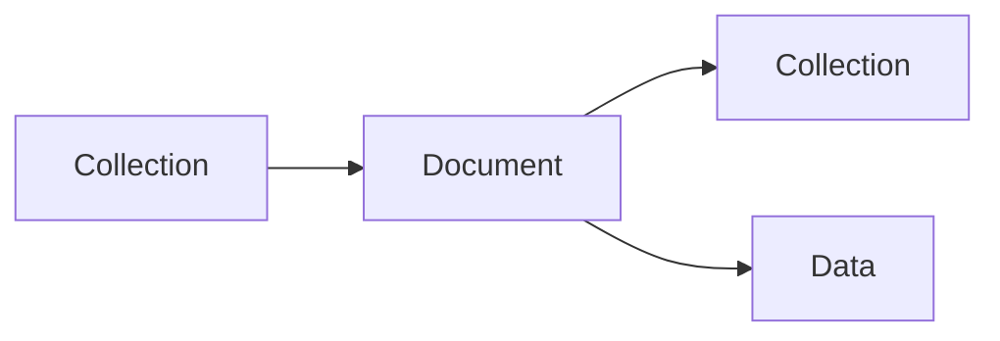

- [Cloud SQL](#cloud-sql)
  - [Introduction to Cloud SQL](#introduction-to-cloud-sql)
  - [Use cases](#use-cases)
  - [Working with Cloud SQL](#working-with-cloud-sql)
    - [Connect using cloud shell](#connect-using-cloud-shell)
  - [Console Overview](#console-overview)
    - [Connections](#connections)
    - [User](#user)
    - [Backups](#backups)
    - [Replicas](#replicas)
    - [Operations](#operations)
  - [Cloud SQL Features](#cloud-sql-features)
  - [Cloud SQL High availability features](#cloud-sql-high-availability-features)
- [Cloud Spanner](#cloud-spanner)
- [Cloud Datastore and Cloud Firestore](#cloud-datastore-and-cloud-firestore)
  - [Datastore](#datastore)
  - [Firestore](#firestore)
- [Cloud BigTable - Wide Column Database](#cloud-bigtable---wide-column-database)
  - [cbt command line tool](#cbt-command-line-tool)
  - [Cloud BigTable table structure](#cloud-bigtable-table-structure)
- [Memorystore](#memorystore)
- [BigQuery](#bigquery)
  - [Accessing and querying data](#accessing-and-querying-data)
- [Cloud SQL, BigTable, BigQuery from CLI](#cloud-sql-bigtable-bigquery-from-cli)
  - [Cloud SQL with CLI: gcloud sql](#cloud-sql-with-cli-gcloud-sql)
  - [BigQuery with CLI - bq](#bigquery-with-cli---bq)
  - [cbt tool - Bigtable CLI](#cbt-tool---bigtable-cli)
- [Importing and Exporting Relational Databases](#importing-and-exporting-relational-databases)
  - [Cloud SQL](#cloud-sql-1)
  - [Cloud Spanner](#cloud-spanner-1)
  - [BigQuery](#bigquery-1)
    - [Data Transfer service in bigquery](#data-transfer-service-in-bigquery)
    - [Cloud Dataflow](#cloud-dataflow)
- [Importing and Exporting NoSQL databases](#importing-and-exporting-nosql-databases)
  - [Cloud Datastore/firestore](#cloud-datastorefirestore)
  - [Cloud Bigtable](#cloud-bigtable)
- [Important points](#important-points)

# Cloud SQL
## Introduction to Cloud SQL
- Fully managed relational database service
  - Configure your needs and do not worry about managing the database.
  - Supports MySQL, PostgreSQL and SQL Server
  - Regional Service Providing High availability(99.95%)
  - Use SSDs or HDDs (for best performance: use SSDs)
  - Upto 416GB of RAM and 30TB of data storage.
## Use cases
- Simple relational use cases:
  - To migrate local MySQL, PostgreSQL and SQL Server databases.
  - To reduce your maintenance cost for simple relational database.
  - (REMEMBER) Use cloud Spanner(Expensive $$$$) instead of Cloud SQL if:
    - Huge volumes of relational data(TBs)
    - Infinite scaling for a growing application(to TBs)
    - need a Global (distributed across multiple regions) Database
    - need higher availability (99.999%)
## Working with Cloud SQL
- Create a instance in cloud sql
- Select your database engine
  - MySQL
  - PostgreSQL
  - SQL Server
- Provide instance ID, password
- Database version
- Choose region or zone
- After instance creation create a database
- Name your database.
- Connect with your database
  - Cloud Shell
  - From a compute engine VM
  - others
### Connect using cloud shell
- Enable Cloud SQL Admin API
- ```gcloud sql connect my-first-cloud-sql-instance --user=root --quiet```
- You're connected with mysql 
- Now we can create tables
  ```sh
  use todos
  create table user (id integer, username varchar(30) );
  describe user;
  insert into user values (1, 'Tushar');
  select * from user;
  ```
## Console Overview
- On Overview page, we can see metrics and monitor our instance
### Connections
- By default it's on public IP, we can configure on private IP
### User
- we can add more user accounts
### Backups
- All the backups that are created
- Create backup
### Replicas
- Create read replica
- 3 replicas can be created in the same region or other region
### Operations
- Operations performed on the database
## Cloud SQL Features
- Automatic encryption(tables/backups), maintenance and updates
- High availability and failover
  - Create a standby with automatic failover
  - Pre requisites: Automated backups and Binary logging
- Read replicas for read workloads
  - Options: Cross-zone, Cross-region and External (NON Cloud SQL DB)
  - Pre requisites: Automated backups and binary logging
- Automatic storage increase without downtime(for newer versions)
- Point-in-time recovery: Enable binary logging
- Backups(Automated and on-demand backups)
- Supports migration from other sources
  - Use database migration service(DMS)
- You can export data from UI(console) or gcloud with formats:
  - SQL(RECOMMENDED if you import data into other databases) and CSV

## Cloud SQL High availability features
- Create a high availablity (HA) configuration
  - Choose primary and secondary zones within a region
  - You will have 2 instancs: Primary and secondary instances
- Changes from primary are replicated synchronously to secondary
- In case of Zonal failure, automatic failover to secondary instance:
  - If primary zone becomes available, failover doesn't revert automatically
- (REMEMBER) High availability setup can't be used as a Read Replica.
  
# Cloud Spanner
- Fully managed, mission critical, relational(SQL), globally distributed database with very high availability(99.999%)
  - Strong transactional consistency at global scale
  - Scales to PBs of data with automatic sharding
- Cloud Spanner scales horizontally for reads and writes.
  - Configure no of nodes
  - (REMEMBER) In comparision, Cloud SQL provides read replicas:
    - But you can't horizontally scale write operations with Cloud SQL.
- Regional and Multi-regional configurations
- Expensive(compared to Cloud SQL): Pay for nodes & Storage
- Data export: Use cloud console to export data
  - Other option is to use data flow to automate export
  - No gcloud export option
# Cloud Datastore and Cloud Firestore
## Datastore
- Highly scalable NoSQL document database
  - Automatically scales and partitions data as it grows
  - Recommended for upto a few TBs of data
    - For bigger volumes, BigTable is recommended
  - Supports transactions, indexes and SQL like queries(GQL)
    - Doesn't support joins or aggregate(sum or count) operations
  - For use cases needing flexible schema with transactions
    - Ex: User profile and product catalogs
  - Structure: Kind>Entity(Use namespaces to group entities)
  - You can export data only from gcloud (NOT from cloud console)
    - Export contains a metadata file and a folder with the data
## Firestore
- Firestore = Datastore ++: Optimized for multi-device access
- Offline mode and data synchronization across multiple devices - mobile, IOT etc.
- Provides client side libraries - Web, IOS, Android and more
- Offers Datastore and native modes.



# Cloud BigTable - Wide Column Database
- Petabyte scale, wide column NoSQL DB(HBase API compatible)
  - IOT streams, analytics, Time Series data etc.
- Handle millions of read/write TPS at very low latency.
- Single row transactions(multi row transactions NOT supported)
- NOT Serverless: You need to create a server instance(Use SSD or HDD)
  - Scale horizontally with multiple nodes(No downtime for cluster resizing)
- Can't export data using cloud console or gcloud.
  - Either use a java application (java -jar JAR export/import) OR
  - Use HBase commands
## cbt command line tool
- Use cbt command line tool to work with BigTable (NOT gcloud)
    - ```cbt createtable my-table```
## Cloud BigTable table structure
- A Wide column database

- At the most basic level, each table is a sorted key/value map
  - Each value in a row is indexed using a key - row key
  - Related columns are grouped into column families
    - Each column is identified by using column-family:column-qualifier(or name)
- This structure supports high read and write throughput at low latency
  - Advantages: Scalable to Petabytes of data with millisecond responses upto millions of TPS.
- Use cases: IOT streams, graph data and real time analytics (time-series data, financial data - transaction histories, stock prices etc.)
- Cloud Dataflow: Used to export data from Bigtable to cloud storage.


# Memorystore
- In-memory database service: Reduce access times
- Fully managed(Provisioning, replication, failover and patching)
  - Highly available with 99.9% availability SLA
  - Monitoring can be easily setup using Cloud Monitoring
- Support for Redis and Memcached:
  - Use memcached for caching
    - Reference data,database query caching, session store etc.
  - Use Redis for low latency access with persistence and high availability
    - Gaming Leader boards, player profiles, in memory stream processing etc.
# BigQuery
- Exabyte scale modern Datawarehousing solution from GCP.
  - Relational database(SQL, schema, consistency etc)
    - Use SQL-like commands to query massive datasets
  - Traditional(Storage+Compute) + Modern(Realtime + Serverless)
- When we are talking about a Datawarehouse, importing and exporting data(and formats) becomes very important:
  - Load data from a variety of sources, incl. streaming data
    - Variety of import formats - CSV/JSON/Avro/Parquet/ORC/Datastore backup
  - Export to Cloud Storage(long term storage) & Data studio (visualization)
    - Formats - CSV/JSON (with Gzip compression), Avro (with deflate or snappy compression)
- Automatically expire data(configurable table expiration)
- Query external data sources without storing data in bigquery
  - Cloud Storage, Cloud SQL, BigTable, Google Drive
  - Use permanent or temporary external tables.

## Accessing and querying data
- Access databases using:
  - Cloud Console
  - bq command line tool (NOT gcloud)
  - BigQuery Rest API or
  - HBase API based libraries(java,.NET,Python)
- (REMEMBER) Bigquery queries can be expensive as you are running them on large data sets.
- (BEST PRACTICE) Estimate bigquery queries before running:
  1. Use UI(console)/bq(```--dry-run```) - Get scanned data volume (estimate)
  2. Use Pricing calculator: Find price for scanning 1 MB data. Calculate cost.

# Cloud SQL, BigTable, BigQuery from CLI
## Cloud SQL with CLI: gcloud sql
- ```gcloud sql instances create/clone/delete/describe/patch```
  - ```gcloud sql instances create INSTANCE```
  - ```gcloud sql instances patch --backup-start-time```
- ```gcloud sql databases create/delete/describe/list/patch```
  - ```gcloud sql databases create DATABASE --instance=INSTANCE```
- ```gcloud sql connect INSTANCE [--database=DATABASE --user=root]```
- ```gcloud sql backups create/describe/list```
  - ```gcloud sql backups create --async --instance [INSTANCE]```(one time backup)

## BigQuery with CLI - bq
- ```bq show bigquery-public-data:samples.tushar```
- ```bq query 'QUERY_STRING'```
  - ```--dry-run``` - To estimate the bytes scanned by a query
- ```bq extract```(export data)
- ```bq load```(load data)
- (REMEMBER) Use the standard way to set the project
  - ```gcloud config set project my-project```
## cbt tool - Bigtable CLI
- Install
  - ```gcloud components install cbt```
- Verify installation
  - ```cbt listinstances```
- Create .cbtrc file with the configuration
  - ```echo project = project-id > ~/.cbtrc```
    - ```echo instance = quickstart-instance >> ~/.cbtrc```
- Create instance
  - ```cbt createinstance```
- Create cluster
  - ```cbt createcluster```
- tables
  - ```cbt createtable/deleteinstance/deletecluster/deletetable```
- ```cbt listinstances/listclusters```
- list tables and column families
  - ```cbt ls```

> You can configure your project with cbt in .cbtrc file


# Importing and Exporting Relational Databases
## Cloud SQL
- to/from cloud storage
  - ```gcloud sql/csv export/import```
  - From console/gcloud/rest api
  - SQL and CSV formats
- For large databases, use serverless mode
  - Reduce performance impact of export on the live database
## Cloud Spanner
- to/from cloud storage
- From console(uses cloud data flow)
## BigQuery
- to/from cloud storage and others(bq extract/load)
- From Console/bq
  - Formats - csv/json(with gzip compression), Avro(with deflate or snappy compression)
- Variety of options to import data:
  - Load data from cloud storage
    - Example use case:: Data Store > Cloud Storage > BigQuery
  - Batch loading with bigquery data transfer service
  - Use dataflow to setup streaming pipeline

### Data Transfer service in bigquery
- A lot of sources it supports, aws and lot more.
- Redshift, teradata etc.
### Cloud Dataflow
- Dataflow provides unified streaming and batch data processing that's serverless, fast, and cost-effective.


# Importing and Exporting NoSQL databases
## Cloud Datastore/firestore
- to/from cloud storage
  - From console/gcloud/restapi
- ```gcloud datastore/firestore export/import --kinds --namespaces```
## Cloud Bigtable
- to/from cloud storage
- Create dataflow jobs
- Formats: Avro/Parquet/SequenceFiles

- REMEMBER: Ensure that service accounts have access to cloud storage buckets.

- ACL(```gsutil acl ch -U SERVICE_ACCOUNT:W BUCKET```) or
- Roles Storage Admin or storage object admin or storage object creator


# Important points
- BigQuery, Datastore, firebase doesn't need VM configuration
  - Whereas Cloud SQL and bigtable need  VM configuration
- Relational Databases
  - Small local databases - Cloud SQL
  - Highly scalable global databases - Cloud Spanner
  - Datawarehouse - BigQuery
- NoSQL Databases
  - Transactional database for a few terabytes of data - Cloud Datastore
  - Huge volumes of IOT or streaming analytics data - Cloud Bigtable.

---


