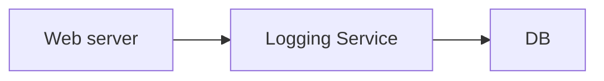
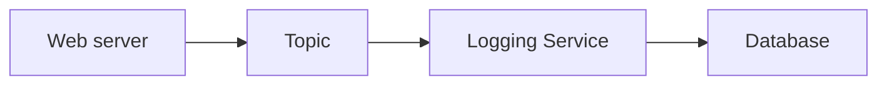

- [Need for Asynchronous communication](#need-for-asynchronous-communication)
  - [Synchronous Communication](#synchronous-communication)
  - [Asynchronous communication - Decoupled](#asynchronous-communication---decoupled)
    - [Advantages](#advantages)
- [Introduction to Pub/Sub](#introduction-to-pubsub)
  - [Usecases](#usecases)
  - [How pub/sub works?](#how-pubsub-works)
    - [Publisher?](#publisher)
    - [Subscriber?](#subscriber)
    - [Publishers and subscribers Relationships](#publishers-and-subscribers-relationships)
- [Publishing and consuming a message](#publishing-and-consuming-a-message)
  - [Step 1. Create a Topic](#step-1-create-a-topic)
  - [Step 2. Create subscriptions on the topic](#step-2-create-subscriptions-on-the-topic)
  - [Sending and Receiving a message](#sending-and-receiving-a-message)
  - [Using Pub/sub](#using-pubsub)
  - [Snapshots](#snapshots)
  - [Pub/Sub lite](#pubsub-lite)
- [Pub Sub with CLI](#pub-sub-with-cli)
  - [gcloud pubsub](#gcloud-pubsub)
# Need for Asynchronous communication
## Synchronous Communication

- Applications on your web server make synchronous calls to the logging service.
- What if your logging service goes down?
  - Will your applications go down too?
- What if all of sudden, there is high load and there are lot of logs coming in?
  - Log service is not able to handle the load and goes down very often.
  
## Asynchronous communication - Decoupled

- Create a topic and have your applications put log messages on the topic.
- Logging service picks them up for processing when ready.
### Advantages
- Decoupling:
  - Publisher(Apps) don't care about who is listening.
- Availability:
  - Publisher(Apps) up even if a subscriber(Logging service) is down.
- Scalability:
  - Scale consumer instances (logging service) under high load.
- Durability:
  - Message is not lost even if subscriber (Logging service) is down.

# Introduction to Pub/Sub
- Reliable, scalable, fully-managed asynchronous messaging service.
- Backbone for highly available and highly scalable solutions:
  - Auto scale to process billions of messages per day.
  - Low cost(Pay for use)
## Usecases
- Event ingestion and delivery for streaming analytics pipelines.
- Supports push and pull message deliveries.

## How pub/sub works?


### Publisher?
- Sender of a message.
- Publishers send messages by making HTTPS requests to pubsub.googleapis.com
### Subscriber?
- Receiver of the message
- Pull:
  - Subscriber pulls messages when ready.
    - Subscriber makes HTTPS requests to pubsub.googleapis.com
- Push:
  - Messages are sent to subscribers.
    - Subscribers provide a web hook endpoint at the time of registration.
    - When a message is received on the topic, A HTTPS POST request is sent to the webhook endpoints.
### Publishers and subscribers Relationships
- Very Flexible Publishers and subscribers Relationships:
  - One to many, Many to One, Many to Many.

# Publishing and consuming a message
## Step 1. Create a Topic
## Step 2. Create subscriptions on the topic
- Subscribers register to the topic
- Each subscription represents discrete pull of messages from a topic:
  - Multiple clients pull same subscription => messages split between clients.
  - Multiple clients create a subscription each => each client will get every message.

## Sending and Receiving a message


- Publisher sends a message to Topic.
- Messages individually delivered to each and every subscription.
  - Subscribers can receive messages either by:
    - Push: Pub/sub sends the message to Subscriber
    - Pull: Subscribers pull for messages
- Subscribers send acknowledgement(s)
- Message(s) are removed from subscriptions message queue.
  - Pub/Sub ensures the message is retained per subscription until it is acknowledged.

## Using Pub/sub
1. Create a topic> Name it ```my-first-topic```
   - Also creates a default subscription
2. Topic and new subscription has been created.
3. Create an additional subscription in the topic.
   - Add subscription id > subscription-2
   - Select delivery type: Pull or push or Write to BigQuery
   - for push, need to configure an endpoint URL.
   - Configure message retention configuration(7 days)
   - Subscription expiration days
   - Acknowledgment deadline
   - Subscription filter for specific type of messages
   - Message ordering, dead lettering, retry policy

4. Publish a message on my-first-topic
   - Go to topic page.
   - go to messages tab.
   - Click on publish message > My first message
5. Go to subscriptions.
   - Do a pull on subscriptions.
   - We can see 3 messages to the topic.
6. send acknowledgement
   - while pulling messages on subscriptions
   - Enable ACK messages
- Messages all should be processed by all the subscriptions.
## Snapshots
- We can take snapshots of only subscriptions not topics.

## Pub/Sub lite
- for zonal, less cost

# Pub Sub with CLI
## gcloud pubsub
- ```gcloud pubsub topics create my-topic```
- ```gcloud pubsub subscriptions create my-first-subscription --topic=my-topic```
  - ```--enable-message-ordering``` Ordered message delivery
  - ```--ack-deadline``` How long to wait for acknowledgement
  - ```--message-filter``` Criteria to filter messages
- ```gcloud pubsub subscriptions pull subscription-name```
  - ```--auto-ack```
- ```gcloud pubsub subscriptions ack my-subscription --ack-ids=[ACK_ID,...]```
- ```gcloud pubsub topics publish topic-from-gcloud --message="My First Message"```
- ```gcloud pubsub topics delete my-topic```
- ```gcloud pubsub topics list```
- ```gcloud pubsub topics list-subscriptions my-topic```
- 