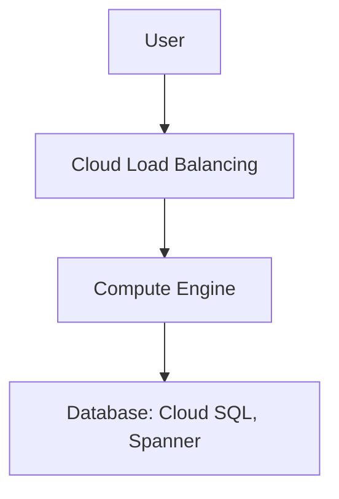

- [Introduction to VPC](#introduction-to-vpc)
  - [Need for VPC](#need-for-vpc)
  - [Google Cloud VPC(Virtual Private Cloud)](#google-cloud-vpcvirtual-private-cloud)
- [Need for VPC Subnets](#need-for-vpc-subnets)
  - [VPC Subnets](#vpc-subnets)
- [Creating VPCs and subnets](#creating-vpcs-and-subnets)
  - [Auto mode VPC network:](#auto-mode-vpc-network)
  - [Custom mode VPC network:](#custom-mode-vpc-network)
  - [Options when you create a subnet](#options-when-you-create-a-subnet)
- [CIDR(Classless Inter-Domain Routing) Blocks](#cidrclassless-inter-domain-routing-blocks)
  - [CIDR Exercises](#cidr-exercises)
- [Creating VPC and Subnets in console](#creating-vpc-and-subnets-in-console)
  - [Default Network](#default-network)
  - [Create a custom VPC](#create-a-custom-vpc)
  - [Create resources in Custom VPC](#create-resources-in-custom-vpc)
- [Firewall Rules in GCP](#firewall-rules-in-gcp)
  - [Firewall Rules - Ingress and Egress Rules](#firewall-rules---ingress-and-egress-rules)
    - [Ingress rules](#ingress-rules)
    - [Egress Rules](#egress-rules)
    - [Definitions with rules](#definitions-with-rules)
- [Shared VPC](#shared-vpc)
  - [Scenario](#scenario)
  - [What are Shared VPCs?](#what-are-shared-vpcs)
- [VPC Peering](#vpc-peering)
  - [Scenario](#scenario-1)
  - [VPC Peering Introduction](#vpc-peering-introduction)
- [Hybrid Cloud](#hybrid-cloud)
  - [Cloud VPN](#cloud-vpn)
  - [Cloud Interconnect](#cloud-interconnect)
    - [Dedicated Interconnect](#dedicated-interconnect)
    - [Partner Interconnect](#partner-interconnect)
    - [Data exchange?](#data-exchange)
  - [Direct Peering](#direct-peering)
# Introduction to VPC
## Need for VPC
- In a corporate network or an on-premises data center:
  - Can anyone on the internet see the data exchange between the application and the database?
    - No
  - Can anyone from internet directly connect to the database?
    - Typically NO.
    - You need to connect to your corporate network and then access your applications or databases.
- Corporate network provides a secure internal network protecting your resources, data and communication from external users.
- How do you do create your own private network in the cloud?
  - Virtual Private Cloud(VPC)

## Google Cloud VPC(Virtual Private Cloud)
- Your own isolated network in GCP cloud.
  - Network traffic within a VPC is isolated(not visible) from all other google cloud VPCs.
- You control all the traffic coming in and going outside a VPC.
- (BEST PRACTICE) Create all your GCP resources(compute, storage, databases etc) within a VPC.
  - Secure resources from unauthorized access
  - Enable secure communication between your cloud resources.
- VPC is global resource & contains subnets in one or more region.
  - (REMEMBER): NOT tied to a region or a zone. VPC resources can be in any region or zone.

# Need for VPC Subnets
- Different types of resources are created on cloud - Databases, compute etc.
  - Each type of resource has its own access needs.
  - Load balancers are accessible from internet(public resources)
  - Databases or VM instances should NOT be accessible from internet.
    - Only applications within your network (VPC) should be able to access them(private resources)

- How do you separate public resources from private resources inside a VPC?
  - Create separate subnets!
  - (Additional Reason)You want to distribute resources across multiple regions for high availability.

## VPC Subnets
- Create different subnets for public and private resources.
  - Resources in a public subnet CAN be accessed from internet.
  - Resources in a private subnet can't be accessed from internet.
  - BUT resources in public subnet can talk to resources in private subnet.
- Each subnet is created in a region.
- Example: VPC - demo-vpc => Subnets - region us-central1, europe-west1 ...


# Creating VPCs and subnets
- By default every proejct has a default VPC.
- You can create your own VPCs:
## Auto mode VPC network:
- Subnets are automatically created in each region.
- Default VPC created automatically in the project uses auto mode!
## Custom mode VPC network:
- No subnets are automatically created.
- You have complete control over subnets and their IP ranges.
- Recommended for production.

## Options when you create a subnet
- Enable Private Google Access
  - Allows VM's to connect to google api's using private IPs
- Enable Flowlogs
  - to troubleshoot any VPC related network issues.

# CIDR(Classless Inter-Domain Routing) Blocks
- Resources in a network use continuous IP addresses to make routing easy:
  - Example: Resources inside a specific network can use IP addresses from 69.208.0.0 to 69.208.0.15
- How do you express a range of addresses that resources in a network can have?
  - CIDR block
- A CIDR Block consists of a starting IP address(69.208.0.0) and a range(/28)
  - Example: CIDR Block ```69.208.0.0/28``` represents addresses from ```69.208.0.0``` to ```69.208.0.15``` - a total of 16 addresses.
- Quick Tip: ```69.208.0.0/28``` indicated that the first 28 bits(out of 32) are fixed:
  - Last 4 bits can change => 2 to the power 4 = 16 addresses.

https://cidr.xyz/

>Total IP Count = 32 - CIDR Range(28) = 4 => 2^4 = 16 addresses.

## CIDR Exercises
- How many addresses ```69.208.0.0/28``` represent
  - 2^(32-26)=64 addresses
  - from 69.208.0.0 to 69.208.0.63```
- How many addresses ```69.208.0.0/30``` represent
  - 2^(32-30) = 4 addresses
  - from 69.208.0.0 to 69.208.0.3
- Difference between 0.0.0.0/0 and 0.0.0.0/32?
  - 0.0.0.0/0 represents all IP Addresses.
  - 0.0.0.0/32 represents only 1 IP Address: 0.0.0.0


# Creating VPC and Subnets in console
## Default Network
- Check default network
- Created in auto mode
- Subnet present in every region

## Create a custom VPC
- Name vpc
- Add subnet
  - name: south-asia1-subnet
  - region: south-asia1
  - Private Google Access: on/off
    - Set whether VMs in this subnet can access Google services without assigning external IP addresses
  - flowlogs
- Configure firewall rules
- Dynamic routing mode
  - Global dynamic routing allows all subnetworks regardless of region to be advertised to your on-premise router and region when using cloud router. With global routing you just need a single VPN with cloud router to dynamically learn routes to and from all Google Cloud regions on a network.
  - Regional: Cloud Routers will learn routes only in the region in which they were created
  - Global: Global routing lets you learn routes dynamically to and from all regions with a single VPN or interconnect and Cloud Router

## Create resources in Custom VPC
- We can create resources in our custom VPC.
- Select VPC: our-custom-vpc
- Create 2 VM instances in default network.
- Create 1 VM instance in custom network.
- Now we can communicate internally between 2 VM insances within default network.
- But we can't communicate internally between VMs not in same network.
- We can basically control the communication between resources and traffic inside and outside network.

# Firewall Rules in GCP
- Configure firewall rules to control traffic going in or out of the network.
  - Stateful
  - Each firewall rule has priority(0-65535) assigned to it.
  - 0 has highest priority. 65535 has least priority.
  - Default implied rule with lowest priority(65535)
    - Allow all egress
    - Deny all ingress
    - Default rules can't be deleted
    - You can override default rules by defining new rules with priority 0-65534.
- Default VPC has 4 additional rules with priority 65534.
  - Allow incoming traffic from VM instances in same network(default-allow-internal)
  - Allow incoming TCP traffic on port 22(SSH) default-allow-ssh.
  - Allow incoming TCP traffic on port 3389(RDP) default-allow-rdp.
  - Allow incoming ICMP from any source on the network default-allow-icmp.
## Firewall Rules - Ingress and Egress Rules
### Ingress rules
- Incoming traffic from outside to GCP targets.
  - ```Target```(defines the destination): All instances or instances with TAG/SA.
  - ```Source```(defines where the traffic is coming from): CIDR - instances with TAG/SA
### Egress Rules
- Outgoing traffic to destination from GCP targets.
  - ```Target```(defines the source): All instances or instances with TAG/SA.
  - ```Destination```: CIDR block.
### Definitions with rules
- ```Priority```: Lower the number, higher the priority.
- ```Action on match```: Allow or deny traffic
- ```Protocol```: ex. TCP or UDP or ICMP
- ```Port```: Which port
- ```Enforcement status```: Enable or disable the rule.

# Shared VPC
## Scenario
- Your organization has multiple projects. You want resources in different projects to talk to each other?
  - How to allow resources in different project to talk with internal IPs securely and efficiently?
## What are Shared VPCs?
- Created at organization or shared folder level(Access needed: Shared VPC Admin)
- Allow VPC network to be shared between projects in same organization.
- Shared VPC contains one host project and multiple service projects:
  - Host project - Contains shared VPC network.
  - Service projects - Attached to host projects
- Helps you achieve separation of concerns:
  - Network administrators responsible for Host projecs and resource users use service projects.

# VPC Peering
## Scenario
- How to connect VPC networks across different organizations?
## VPC Peering Introduction
- Networks in same project, different projects and across projects in different organizations can be peered.
- All communication happens using internal IP addresses
  - Highly efficient because all communication happens inside Google Network.
  - Highly secure because not accessible from internet.
  - No data transfer charges for data transfer between services.
- (REMEMBER) Network administration is NOT charged.
  - Admin of one VPC do not get the role automatically in a peered network.


# Hybrid Cloud
- How to connect on-premise network with Google network.
## Cloud VPN
- Connect on-premise network to GCP network.
  - Implemented using IPSec VPN Tunnel
  - Traffic through internet(public)
  - Traffic encrypted using internet key exchange protocol.
- Two types of Cloud VPN solutions: 
  - HA VPN: SLA of 99.99% service availability with 2 external IP addresses
    - Only dynamic routing (BGP) supported
  - Classic VPN: SLA of 99.9% service availability, a single external IP address
    - Supports static routing(Policy based, route based), and dynamic routing using BGP.

> BGP: Border Gateway Protocol (BGP) is a dynamic network protocol that uses predetermined standards to facilitate communication between network devices.

## Cloud Interconnect
- High speed physical connection between on-premise and VPC networks:
  - Highly available and high throughput
### Dedicated Interconnect
- 10 GBps or 100GBps configurations
### Partner Interconnect
- 50 MBps to 10 GBps configurations
### Data exchange?
- Data exchange happens through a private network:
  - Communicate using VPC network's internal IP addresses from on-premises network.
  - Reduce egress costs
    - As public internet is not used
- Feature: Supported Google API's and services can be privately accessed from on-premise
- Use only for high bandwidth needs
  - For low bandwidth, Cloud VPN is recommended.

## Direct Peering
- Connect customer network to Google Network using network peering
  - Direct path from on-premises network to Google Services
- Not a GCP Service
  - Lower level network connection outside of GCP
- NOT RECOMMENDED:
  - Use Cloud Interconnect and Cloud VPN.

