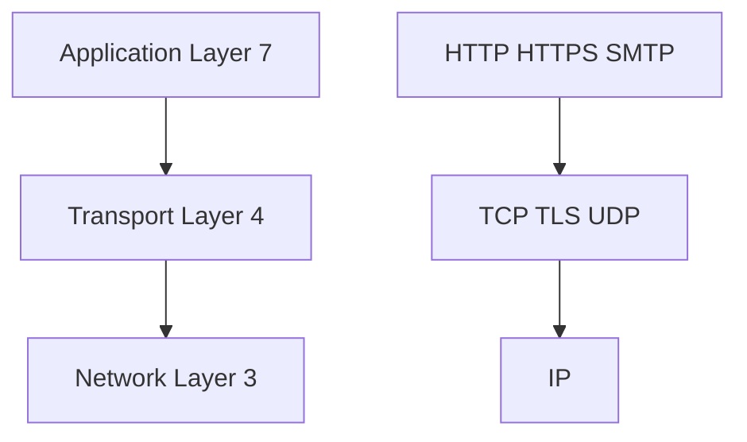

- [Cloud Load Balancer](#cloud-load-balancer)
  - [What is Cloud Load Balancer?](#what-is-cloud-load-balancer)
    - [Important Features](#important-features)
    - [Benefits(It enables?)](#benefitsit-enables)
- [HTTP, HTTPS, UDP and TCP Protocols](#http-https-udp-and-tcp-protocols)
  - [Network Layer](#network-layer)
    - [IP(Internet Protocol)](#ipinternet-protocol)
    - [Transport Layer](#transport-layer)
    - [TCP(Transmission Control)](#tcptransmission-control)
    - [UDP(User datagram protocol)](#udpuser-datagram-protocol)
  - [Application Layer](#application-layer)
    - [HTTP(Hypertext transfer protocol)](#httphypertext-transfer-protocol)
    - [HTTPS](#https)
    - [SMTP: Email Transfer Protocol](#smtp-email-transfer-protocol)
- [Creating Load Balancer in GCP](#creating-load-balancer-in-gcp)
    - [HTTP(S) Load balancer](#https-load-balancer)
- [Load Balancer Terminology](#load-balancer-terminology)
  - [Backend](#backend)
  - [Frontend](#frontend)
  - [Host and path rules(for HTTP(s) load balancing)](#host-and-path-rulesfor-https-load-balancing)
  - [Load balancing- SSL/TLS Termination/Offloading](#load-balancing--ssltls-terminationoffloading)
- [Exploring Load Balancer in GCP](#exploring-load-balancer-in-gcp)
- [Choosing a Load Balancer in GCP](#choosing-a-load-balancer-in-gcp)
- [Features of Cloud Load Balancing](#features-of-cloud-load-balancing)
- [Load Balancer Scenarios](#load-balancer-scenarios)
    - [You want only healthy instances to receive traffic](#you-want-only-healthy-instances-to-receive-traffic)
    - [You want high availability for your VM instances](#you-want-high-availability-for-your-vm-instances)
    - [You want to route requests to multiple microservices using the same load balancer](#you-want-to-route-requests-to-multiple-microservices-using-the-same-load-balancer)
    - [You want to load balance global external instances, across multiple regions](#you-want-to-load-balance-global-external-instances-across-multiple-regions)
    - [You want SSL Termination for Global non-HTTPS traffic with load balancing](#you-want-ssl-termination-for-global-non-https-traffic-with-load-balancing)


# Cloud Load Balancer
## What is Cloud Load Balancer?
- Distributes user traffic across instances of an application in single region or multiple regions
  - Fully distributed, software defined managed service
### Important Features
- Health Check - Route to healthy instances
  - Recover from failures
- Auto Scaling
- Global load balancing with single anycast IP
  - Can listen traffic from multiple location around the world.
  - Also supports internal Load balancing
### Benefits(It enables?)
- High availability
- Auto Scaling
- Resiliency
---

# HTTP, HTTPS, UDP and TCP Protocols



- Computers use protocol to communicate
- Multiple layers and multiple protocols
## Network Layer
- Transfer bits and bytes
  ### IP(Internet Protocol)
    - Transfer bytes. Unreliable
  ### Transport Layer
  - Are the bits and bytes transferred properly?
  ### TCP(Transmission Control)
  - Reliability > Performance
  ### UDP(User datagram protocol)
  - Performance>Reliability
  
## Application Layer
- Make REST API calls and send emails
  ### HTTP(Hypertext transfer protocol)
  - Stateless request response cycle
  ### HTTPS
  - Secure HTTP
  ### SMTP: Email Transfer Protocol
- Most applications typically communicate at application layer
  - Web Apps/Rest API(HTTP/HTTPS), Email servers(SMTP), File Transfer protocol(FTP)
  - All these applications use TCP/TLS at network layer(for reliability)
- However applications needing high performance directly communicate at transport layer:
  - Gaming applications and live video streaming use UDP(Sacrifice reliability for performance)

>REMEMBER: Each layer makes use of the llayers beneath it.
>REMEMBER: Most applications talk at application layer. BUT some applications talk at network layer directly(high performance)

---

# Creating Load Balancer in GCP
- **Load Balancing** a part of network services in GCP.
- Go to console > Click create Load Balancer
- 3 types of load balancing
  1. HTTP(S) Load Balancing
  2. TCP Load Balancing
  3. UDP Load Balancing(Single region only)


### HTTP(S) Load balancer
- From internet to VMs
- Backend Configuration
  - Where we want to redirect our incoming traffic to(MIGs).
  - Create a Backend Service
    - Give it a name
    - Backend type: instance group
    - Balancing mode
- Frontend Configuration
  - Where we receive the traffic.
- Host and Path rules
  - Configure rules for how we want to send traffic to Backend.
  - Useful for where we're using microservices.
  

# Load Balancer Terminology


## Backend
- Group of endpoints that receive traffic from a Google CLoud Load balancer(example: instance groups)
## Frontend
- Specify an IP address, port and protocol. This IP address is the frontend IP for our client requests.
  - For SSL, a certificate must also be assigned.
## Host and path rules(for HTTP(s) load balancing)
- Define rules redirecting the traffic to different backends
  - Based on path: 
    - ```kubekode.org/courses``` vs ```kubekode.org/login```
  - Based on Host:
    - ```kubekode.org``` vs ```blog.kubekode.org```

## Load balancing- SSL/TLS Termination/Offloading
- Client to Load balancer: Over internet
  - HTTPS Recommended
- Load balancer to VM instance: Through Google internal network
  - HTTP is ok. HTTPS is preferred
- SSL/TLS Termination/Offloading
  - Client to Load balancer: HTTPS/TLS
  - Load balancer to VM Instance: HTTP/TCP


# Exploring Load Balancer in GCP


# Choosing a Load Balancer in GCP


# Features of Cloud Load Balancing
| **Load Balancer**        | **Type of Traffic**                       | **Proxy or Pass-through** | **Destination ports**       |
|--------------------------|-------------------------------------------|---------------------------|-----------------------------|
| External HTTP(S)         | Global, External, HTTP or HTTPS           | Proxy                     | HTTP(80 or 8080) HTTPS(443) |
| Internal HTTP(S)         | Regional, Internal, HTTP or HTTPS         | Proxy                     | HTTP(80 or 8080) HTTP(443)  |
| SSL Proxy                | Global, External, TCP with SSL Offload    | Proxy                     | A big list                  |
| TCP Proxy                | Global, External, TCP without SSL Offload | Proxy                     | A big list                  |
| External Network TCP/UDP | Regional, External, TCP or UDP            | Pass-through              | any                         |
| Internal TCP/UDP         | Regional, Internal, TCP or UDP            | Pass-through              | any                         |

---

# Load Balancer Scenarios
### You want only healthy instances to receive traffic
- Configure health check
### You want high availability for your VM instances
- Create multiple MIGs for your VM instances in multiple regions. Load balance using a load balancer.
### You want to route requests to multiple microservices using the same load balancer
- Create individual MIGs and backends for each microservice
- Create host and path rules to redirect to specific microservice.
- Backend based on the path(/microsrevice-a, /microservice-b etc.)
- You can route to a backend cloud storage bucket as well.
### You want to load balance global external instances, across multiple regions
- Create External HTTP(S) Load balancer
### You want SSL Termination for Global non-HTTPS traffic with load balancing
- Choose SSL Proxy load balancer


---

