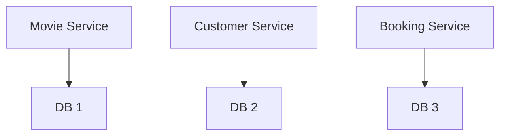

- [What are managed Services?](#what-are-managed-services)
- [IAAS and PAAS](#iaas-and-paas)
  - [Infrastructure as a Service(IAAS)](#infrastructure-as-a-serviceiaas)
  - [Platform as a Service (PAAS)](#platform-as-a-service-paas)
    - [CAAS(Container as a Service)](#caascontainer-as-a-service)
    - [FAAS(function as a Service)](#faasfunction-as-a-service)
    - [Database as a Service](#database-as-a-service)
- [Understanding Evolution of Containers and Microservices](#understanding-evolution-of-containers-and-microservices)
  - [Microservices](#microservices)
  - [Containers- Docker](#containers--docker)
  - [Container Orchestration](#container-orchestration)
    - [Features](#features)
- [Serverless](#serverless)
  - [Serverless important features](#serverless-important-features)
  - [Examples:](#examples)
- [GCP Managed services for Compute](#gcp-managed-services-for-compute)
  - [Compute Engine](#compute-engine)
  - [Google Kubernetes Engine](#google-kubernetes-engine)
  - [App Engine](#app-engine)
  - [Cloud Functions](#cloud-functions)
  - [Cloud Run](#cloud-run)
# What are managed Services?
- Do you want to continue running applications  in the cloud, the same way you run them in your data center?
- OR are there other approaches?

# IAAS and PAAS
## Infrastructure as a Service(IAAS)
- Use only infrastructure from cloud provider
- Example: Using VM to deploy your applications or databases.
- You're responsible for:
  - Application code and runtime
  - Configuring load balancing
  - Auto scaling
  - OS upgrades and patches
  - Availability

|                     |
|---------------------|
| Application*         |
| Application Runtime* |
| OS*                  |
| Virtualization      |
| Physical Hardware   |
| Networking          |

## Platform as a Service (PAAS)

- Use a platform provided by cloud.
- Cloud provider is responsible for:
  - OS
  - Application runtime
  - Autoscaling, availability & Load balancing etc.
- You are responsible for:
  - Configuration(of application and services)
  - Application code(if needed)

- Varieties:
### CAAS(Container as a Service)
- Containers instead of apps
### FAAS(function as a Service)
- Functions instead of apps
### Database as a Service
- Relations & NoSQL
  - Amazon RDS, Google Cloud SQL, Azure SQL Database etc.
- Queues, AI, ML, Operations etc.

|                     |
|---------------------|
| Application*         |
| Application Runtime |
| OS                  |
| Virtualization      |
| Physical Hardware   |
| Networking          |

---

# Understanding Evolution of Containers and Microservices
## Microservices
- Enterprises are heading towards microservices architectures.
  - Build small focused microservices
  - Flexibility to innovate and build applications in different programming languages(Go, Java, Python, JavaScript etc.)

- BUT deployments become complex.
- How can we have one way of deploying Go, Java, Python, or JavaScript microservices?
  - Enter Containers.

## Containers- Docker
- Create Docker images for each microservice
- Docker image has all needs of a microservice:
  - Application runtime
  - Application code and dependencies
- Run the same way on any infrastructure.
  - Local machine
  - Corporate data center
  - Cloud

## Container Orchestration
- Requirement: I want 10 instances of microservice A container, 15 instances of Microservice B container and so on..
- Kubernetes is one of the popular container orchestrator.
### Features
- Auto Scaling:
  - Scale containers based on demand
- Service Discovery
  - Help microservices find one another
- Load Balancer
  - Distribute load among multiple instances of a microservice
- Self healing
  - Do health checks and replace failing instances.
- Zero downtime deployments
  - Release new versions without downtime.

# Serverless
- Zero visibility intro infrastructure
- Pay for use
  - Zero requests = zero cost
- Only focus on code
- Pay for requests not for servers.
- Examples:
  - Functions as a Service:
    - Cloud Functions
    - AWS Lambda
    - Azure functions
## Serverless important features
- Level 1: 
  - Zero worry about infrastructure, scaling and avaialability
  - Zero invocations = Zero Cost(can you scale down to Zero instances?)
- Level 2:
  - Zero worry about infrastructure, scaling and avaialability
  - Zero invocations = Zero Cost(can you scale down to Zero instances?)
  - Pay for invocations and NOT for instances(or node or servers)

## Examples:
- Level 1: Google App Engine, AWS Fargate
  - Scale down to zero instances where there is no load, but you pay for number (and type) of instances running
- Level 2: Google Cloud Functions, AWS Lambda, Azure functions.
  - Pay for requests

# GCP Managed services for Compute
## Compute Engine
- High performance and general purpose VMs that scale globally
- IaaS
## Google Kubernetes Engine
- Orchestrate containerized microsrevices on kubernetes
- Needs advanced cluster configuration and monitoring
- CaaS
## App Engine
- Build highly scalable applications on a fully managed platform using open and familiar languages and tools
- PaaS(CaaS, Serverless)
## Cloud Functions
- Build event driven applications using simple, single-purpose functions
- FaaS, Serverless
## Cloud Run
- Develop and deploy highly scalable containerized applications
- Doesn't need a cluster
- CaaS(Serverless)

