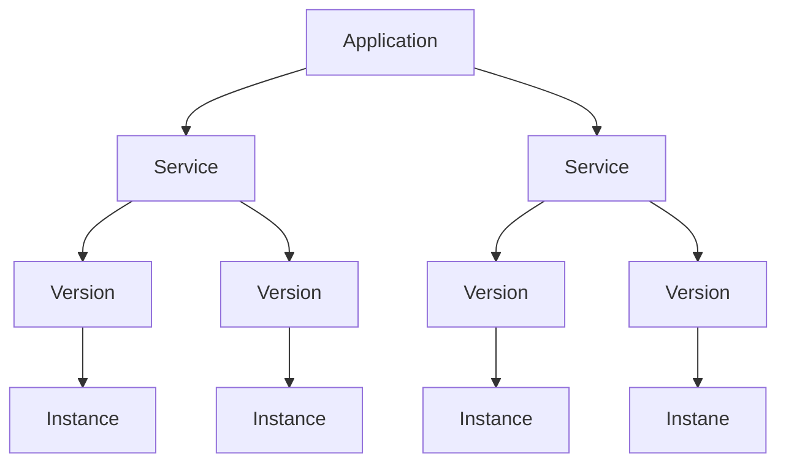

- [App Engine](#app-engine)
  - [What is app engine?](#what-is-app-engine)
  - [Supports:](#supports)
  - [Features](#features)
  - [Compute Engine vs App Engine](#compute-engine-vs-app-engine)
    - [Compute Engine](#compute-engine)
    - [App Engine](#app-engine-1)
- [App Engine environments](#app-engine-environments)
  - [Standard Environment](#standard-environment)
    - [v1: Java, Python, PHP, Go(OLD Versions)](#v1-java-python-php-goold-versions)
    - [v2: Java,Python, PHP, Node.js, Ruby, Go (NEWER Version)](#v2-javapython-php-nodejs-ruby-go-newer-version)
  - [Flexible Environment](#flexible-environment)
- [Application Component Hierarchy](#application-component-hierarchy)
  - [Application](#application)
  - [Service(s)](#services)
  - [Version(s)](#versions)
- [Standard vs Flexible environments](#standard-vs-flexible-environments)
- [Scaling App Engine instances](#scaling-app-engine-instances)
  - [Automatic](#automatic)
  - [Basic](#basic)
  - [Manual](#manual)
- [Deploy an App to App Engine](#deploy-an-app-to-app-engine)
  - [Create Application in App Engine(Only one in a project)](#create-application-in-app-engineonly-one-in-a-project)
  - [Deploy services to App Engine](#deploy-services-to-app-engine)
    - [Config file: app.yaml file(required)](#config-file-appyaml-filerequired)
    - [Default Service](#default-service)
    - [As many services other than default](#as-many-services-other-than-default)
- [Exploring apps, services, versions](#exploring-apps-services-versions)
  - [Services](#services-1)
  - [Deploying new versions](#deploying-new-versions)
  - [Find url of deployed service](#find-url-of-deployed-service)
- [Splitting traffic between Multiple versions in app engine](#splitting-traffic-between-multiple-versions-in-app-engine)
  - [Deploy a new version but not switch the traffic to it, immediately(--no-promote)](#deploy-a-new-version-but-not-switch-the-traffic-to-it-immediately--no-promote)
  - [Spliting traffic between v2 and v3](#spliting-traffic-between-v2-and-v3)
    - [ways to spliting traffic](#ways-to-spliting-traffic)
  - [Migrate traffic](#migrate-traffic)
- [More about app.yaml (Config file)](#more-about-appyaml-config-file)
- [Request routing in GAE](#request-routing-in-gae)
  - [Routing with URLs](#routing-with-urls)
  - [Routing with a dispatch file](#routing-with-a-dispatch-file)
  - [Routing with Cloud Load Balancing](#routing-with-cloud-load-balancing)
- [Deploying new versions without downtime](#deploying-new-versions-without-downtime)
    - [Option 1: I'm very confident - Deploy \& Shift all traffic at once.](#option-1-im-very-confident---deploy--shift-all-traffic-at-once)
    - [Option 2: I want to manage the migration from v1 to v2](#option-2-i-want-to-manage-the-migration-from-v1-to-v2)
- [How to split traffic between multiple versions?](#how-to-split-traffic-between-multiple-versions)
  - [IP Splitting - Based on request IP Address](#ip-splitting---based-on-request-ip-address)
  - [Cookie Splitting - Based on a cookie (GOOGPPUID)](#cookie-splitting---based-on-a-cookie-googppuid)
  - [Random - Do it randomly](#random---do-it-randomly)
  - [Splitting traffics](#splitting-traffics)
- [Explore gcloud commands for app engine](#explore-gcloud-commands-for-app-engine)
  - [gcloud app](#gcloud-app)
    - [gcloud app browse/create/deploy/describe/open-console](#gcloud-app-browsecreatedeploydescribeopen-console)
  - [gcloud app instances](#gcloud-app-instances)
    - [gcloud app instances delete/describe/list/scp/ssh](#gcloud-app-instances-deletedescribelistscpssh)
  - [gcloud app services and versions](#gcloud-app-services-and-versions)
    - [gcloud app services browse/delete/describe/list/set-traffic](#gcloud-app-services-browsedeletedescribelistset-traffic)
    - [gcloud app versions browse/delete/describe/list/migrate/start/stop](#gcloud-app-versions-browsedeletedescribelistmigratestartstop)
- [Cron Jobs in App Engine](#cron-jobs-in-app-engine)
  - [Use cases:](#use-cases)
- [App Engine yaml files: Dispatch, queue](#app-engine-yaml-files-dispatch-queue)
  - [Dispatch.yaml : override routing rules](#dispatchyaml--override-routing-rules)
  - [Queue.yaml - manage task queues](#queueyaml---manage-task-queues)
- [Important points](#important-points)
- [Scenarios](#scenarios)
    - [I want to create two google app engine apps in the same project](#i-want-to-create-two-google-app-engine-apps-in-the-same-project)
    - [I want to create two Google App Engine Services inside the same App](#i-want-to-create-two-google-app-engine-services-inside-the-same-app)
    - [I want to move my App Engine app to a different region](#i-want-to-move-my-app-engine-app-to-a-different-region)
    - [Perform canary deployments](#perform-canary-deployments)
# App Engine
## What is app engine?
- Simplest way to deploy and scale your applications in GCP.
  - Provides end-to-end application management
## Supports:
  - Go, Java, .NET, Node.js, PHP, Ruby using pre-configures runtimes.
  - Use custom runtime and write code in any language
  - Connect to variety of Google Cloud Storage products(Cloud SQL etc.)
- No usage charges
  - Pay for resources provisioned
## Features
- Automatic Load balancing & Autoscaling
- Managed platform Updates & application health monitoring
- Application Versioning
- Traffic splitting
## Compute Engine vs App Engine
### Compute Engine
- IAAS
- More flexibility
- More responsibility
  - Choosing image
  - Installing software
  - Choosing hardware
  - Fine grained access/permissions(certificates/firewalls)
  - Availability etc.
### App Engine
- PAAS
- Serverless
- Lesser responsibility
- Lower flexibility


# App Engine environments
## Standard Environment
- Applications run in language specific sandbxes
  - Complete isolation from OS/Disk/Other apps
### v1: Java, Python, PHP, Go(OLD Versions)
- ONLY for python and PHP runtimes:
  - Restricted network access
  - Only white-listed extensions and libraries are allowed
- No Restrictions for Java and Go Runtimes
### v2: Java,Python, PHP, Node.js, Ruby, Go (NEWER Version)
- Full network access and No restrictions on language extensions

## Flexible Environment
- Application instances run within Docker containers
  - Makes use of Compute Engine virtual machines
  - Support any runtime(with built-in support for Python, Java, Nodejs, Go, Ruby, PHP or .NET)
  - Provides access to background processes and local disks

# Application Component Hierarchy

## Application
- One App per Project
## Service(s)
- Multiple microservices or app components
  - You can have multiple services in a single application.
  - Each **Service** can have different settings
  - Earlier called modules.
## Version(s)
- Each version associated with code and configuration.
- Multiple versions can co-exist
- Options to rollback and split traffic


# Standard vs Flexible environments
| Feature               | Standard                                         | Flexible                            |
|-----------------------|--------------------------------------------------|-------------------------------------|
| Pricing Factors       | Instance hours                                   | vCPU, Memory & Persistent Disks     |
| Scaling               | Manual, Basic, Automatic                         | Manual, Automatic                   |
| Scaling to zero       | Yes                                              | No. Minimum one instance            |
| Instance startup time | seconds                                          | Minuts                              |
| Rapid scaling         | Yes                                              | No                                  |
| Max. Request timeout  | 1 to 10 minuts                                   | 60 minuts                           |
| Local disk            | Mostly(except for python,php). Can write to /tmp | Yes. Ephemeral. New disk on startup |
| SSH for debugging     | No                                               | Yes                                 |

---

# Scaling App Engine instances
## Automatic
- Automatically scale instances based on the load
  - Recommended for continuously Running workloads
  - Autoscale based on:
    - Target CPU Utilization - Configure a CPU usage threshold.
    - Target Throughput utilization - Configure a throughput threshold.
    - Max concurrent requests - Configure max concurrent requests an instance can receive
  - Configure max instances and min instances
## Basic
- Instances are created as and when requests are received.
  - Recommended for Adhoc workloads.
    - Instances are shutdown if ZERO requests
      - Tries to keep costs low
      - High latency is possible
    - NOT support by app engine flexible environment
    - Configure Max instances and idle timeout
## Manual
- Configure specific number of instances to run.
  - Adjust number of instances manually over time.

# Deploy an App to App Engine
- Create a new project: app-engine-practice
- Enable App Engine Admin API
## Create Application in App Engine(Only one in a project)
- Add Region (For multiple region, we need multiple projects)
## Deploy services to App Engine
- Example Python Service:
  - ```main.py```
  - ```app.yaml```: Required app engine configuration file 
  - ```requirements.txt```
### Config file: app.yaml file(required)
- It's a required file always for app engine application services. Here we define configurations for our application to run on app engine.
  - service name
  - runtime
  - environment variables
- If your config file name is not ```app.yaml``` then while deploying to app engine you need to pass the flag for file name also to deploy the app engine service.
- You can use multiple config files like ```dev_app.yaml```, ```prod_app.yaml```


### Default Service
- Default servie is a default service in every App Engine application.
- app.yaml
  - ```yaml
    runtime: python39
    ```
- Run the command: ```gcloud app deploy```
- Our  first version of default service will be deployed.
- Deploy using a specific config file
  ```sh
  gcloud app deploy dev_app.yaml
  ```

### As many services other than default
- Other services require a service name also in app.yaml or configuration files
    ```yaml
    runtime: python39
    service: my-first-service
    ```


> Checkout more app engine application examples <a href="https://github.com/GoogleCloudPlatform/nodejs-docs-samples/tree/main/appengine">here</a>


# Exploring apps, services, versions
## Services 
- List all services
  - ```gcloud app services list```
## Deploying new versions
- Make changes in your application code.
- use ```gcloud app deploy```: it will automatically assign new version to the new service deployment
- use ```gcloud app deploy --version=v2``` to assign version manually
- List all versions in app engine: 
  - ```gcloud app versions list```
  - ```gcloud app versions list --service=my-first-service```
- When you deploy a new version in app engine service, the old version will be still there, but traffic will be switched to newer one.
- When you deploy a new version:
  - Traffic will be switched to the newer version automatically
## Find url of deployed service
- ```gcloud app browse```: default service
- pass your service name
- ```gcloud app browse --service=my-first-service```
- Pass a specific version also
- ```gcloud app browse --service=my-first-service --version=v1```

# Splitting traffic between Multiple versions in app engine
## Deploy a new version but not switch the traffic to it, immediately(--no-promote)
- make changes to application code
- Deploy new version and add flag for not switch the traffic to new version
    ```
    gcloud app deploy --version=v3 --no-promote
    ```
- the default option is ```--promote``` but we used ```--no-promote``` so that it will not promote the traffic to new version.

- Now we have 3 versions in our service: v1,v2,v3
- v2 is serving traffic, v3 is newer one but not serving traffic.
- Now first let's test version v3
  - ```gcloud app browse --version v3```
- After testing, we want to make it live.
- And we don't want to send all the traffic to newer version, but we want only some traffic to v3.
## Spliting traffic between v2 and v3
```sh
gcloud app services set-traffic [MY_SERVICE] --splits [MY_VERSION1]=[VERSION1_WEIGHT],[MY_VERSION2]=[VERSION2_WEIGHT] --split-by [IP_OR_COOKIE]
```
- We can split traffic between v2 and v3
- command: ```app services set-traffic```
- use option: ```--splits=v3=.5,v2=.5```
- So run this command to split traffic 50-50 between v2 and v3
  - ```gcloud app services set-traffic --splits=v3=.5,v2=.5```

### ways to spliting traffic
- Default way to split the traffic is by IP.
- also other options are like: random, by cookie.
- To choose another options
```
gcloud app services set-traffic --splits=v3=.5,v2=.5 --split-by=random
```

## Migrate traffic
- Basically means, not splitting but switching all traffic to a specific version.

- To migrate traffic immediately:
  ```sh
  gcloud app services set-traffic [MY_SERVICE] --splits [MY_VERSION]=1
  ```
- To gradually migrate traffic, you include the optional --migrate flag:
  ```sh
  gcloud app services set-traffic [MY_SERVICE] --splits [MY_VERSION]=1 --migrate
  ```

# More about app.yaml (Config file)

```yaml
runtime: python39 # the name of the runtime environment used by our app
api_version: 1 #RECOMMENDED - specify here - gcloud app deploy -v [YOUR_VERSION_ID]
instance_class: F1
service: service-name
#env: flex

#for containers
inbound_services:
  - warmup
# Environment variables
env_variables:
  ENV_VARIABLE: "value"

handlers:
- url: /
  script: home.app

# Autoscaling configuration
automatic_scaling:
  target_cpu_utilization: 0.65
  min_instances: 5
  max_instances: 100
  max_concurrent_requests: 50
# basic_scaling:
#   max_instances: 11
#   idle_timeout: 10m
# manual_scaling:
#   instances: 5
```

# Request routing in GAE
- You can use a combination of three approaches
## Routing with URLs
- ```https://PROJECT_ID.REGION_ID.r.appsport.com```(default service called)
- ```https://SERVICE-dot-PROJECT_ID.REGION_ID.r.appsport.com``` (specific Service)
- ```https://VERSION-dot-SERVICE-dot-PROJECT_ID.REGION_ID.r.appsport.com```(specific version of service)
- Replace ```-dot-``` with ```.``` if using custom domain
## Routing with a dispatch file
- Configure dispatch.yaml with routes.
- ```gcloud app deploy dispatch.yaml```
## Routing with Cloud Load Balancing
- Configure routing in app engine using Cloud Load Balancing

# Deploying new versions without downtime
- How do I go from v1 to v2 without downtime?
### Option 1: I'm very confident - Deploy & Shift all traffic at once.
- Deploy and shift all traffic at once from v1 to v2: ```gcloud app deploy```
### Option 2: I want to manage the migration from v1 to v2
- Step1: Deploy v2 without shifting traffic ```--no-promote```
  - ```gcloud app deploy --no-promote```
- Step 2: Shift traffic to v2:
  - Option1: (All at once migration): Migrate all at once to v2
    - ```gcloud app services set-traffic s1 --splits v2=1```
  - Option2: (Gradual Migration): Gradually shift traffic to v2. Add --migrate option.
    - gradual migration is not supported by app engine flexible environment
  - Option3: (Splitting): Control the pace of migration
    - ```gcloud app services set-traffic s1 --splits=v2=.5,v1=.5```
    - useful to perform A/B Testing

# How to split traffic between multiple versions?
- How do you decide which version receives which traffic?
## IP Splitting - Based on request IP Address
- IP Addresses can change causing accuracy issues!(I go from my house ot a coffee shop)
- If all requests originate from a corporate VPN with single IP, this can cause all requests to go to the same version.
## Cookie Splitting - Based on a cookie (GOOGPPUID)
- Cookies can be controlled from your application.
- Cookies splitting accurately assign users to versions.
## Random - Do it randomly
## Splitting traffics
- Include ```--split-by``` option in ```gcloud app services set-traffic SERVICE_NAME ``` command
  - value must be one of: cookie, ip, random


# Explore gcloud commands for app engine
## gcloud app
### gcloud app browse/create/deploy/describe/open-console
- ```gcloud app create --region=us-central```
- ```gcloud app deploy app.yaml```
  - ```--image-url```: Only for flexible environments. Deploy docker image
    - ```gcloud app deploy --image-url gcr.io/PROJECT_ID/hello-word:latest```
  - ```--promote``` ```--no-promote```(Should new version receive traffic?)
  - ```--stop-previous-version```,```--no-stop-previous-version```(Should old version be stopped after new version receives all traffic?)
  - ```--version```(Assign a version, otherwise a verion number is generated)
- ```gcloud app browse --service="my-service" --version="v1"```(Open in a web browser)
- ```gcloud app open-console --service="myservice" --version="v1"```
- ```gcloud app open-console --logs```
- ```gcloud app logs tail```
- ```gcloud app regions list```

## gcloud app instances
### gcloud app instances delete/describe/list/scp/ssh
- ```gcloud app instances delete i1 --service=s1 --version=v1```
- ```gcloud app instances describe --service=s1 --version=v1 i1```
- ```gcloud app instances list```
- ```gcloud app instances scp --service=s1 --version=v1 --recurse local_dir i1:remote_dir```: Copy files to/from App engine flexible instances
- ```gcloud app instances ssh --service=s1 --version=v1 i1```(SSH into VM of an APp Engine flexible instance)

## gcloud app services and versions
### gcloud app services browse/delete/describe/list/set-traffic
- ```gcloud app services list```
- ```gcloud app services browse myservice --version=v1```
- ```gcloud app services delete service1 service2```
- ```gcloud app services describe service1```
- ```gcloud app services set-traffic APP1 --splits v1=.9,v2=.1```
  - ```--split-by```(ip,cookie,random)
### gcloud app versions browse/delete/describe/list/migrate/start/stop
- ```gcloud app versions list```
  - ```--hide-no-traffic```(only show version which receiving traffic)
- ```gcloud app versions browse/delete/describe v1 --service="myservice"```
- ```gcloud app versions migrate v2 --service="myservice" ```(Migrate all traffic to new version)
- ```gcloud app versions start/stop v1```
  - ```--service=myservice```Only start v1 of service: myservice


# Cron Jobs in App Engine
```yaml
cron:
  - description: "daily summary job"
    url: /tasks/summary
    schedule: every 24 hours
```
- Allows to run scheduled jobs at pre-defined intervals
- Configured using cron.yaml
## Use cases:
  - Send a report by email every day
  - Refresh cache data every 30 minuts
- Run this command - ```gcloud app deploy cron.yaml```
  - performs a HTTP GET request to the configured URL on schedule.

# App Engine yaml files: Dispatch, queue
## Dispatch.yaml : override routing rules
```yaml
dispatch:
    - url: "*/mobile/*"
      service: mobile-frontend
    - url: "*/work/*"
      service: static-backend
```
## Queue.yaml - manage task queues
```yaml
queue:
  - name: fooqueue
    rate: 1/s
    retry_parameters:
      task_retry_limit: 7
      task_age_limit: 2d
```

# Important points
- App Engine is Regional(Services deployed across zones)
  - You can't change an application's region
- Good option fo simple microservices(multiple services)
  - Use standard v2 when you're using supported languages
  - Use Flexible if you're building containerized apps.
- Be aware- Atleast on container is always running when using flexible:
  - Go for standard if you want to be able to scale down to the number of instances to zero when there is no load.
- Use a combination of resident and dynamic resources.
  - Resident instances: Run continuously
  - Dynamic Instances: Added based on load
    - Use all dynamic instances if you're cost sensitive
    - If you're not very cost sensitive, keep a set of resident instances running always.


# Scenarios
### I want to create two google app engine apps in the same project
- Not possible, you can only have one App Engine app per project. However you can have multiple services and multiple version for each service.
### I want to create two Google App Engine Services inside the same App
- Possible. You can create multiple services under the same app. Each service can have multiple versions as well.
### I want to move my App Engine app to a different region
- App Engine App is region specific. You can't move it to different region.
- Create a new project and create new app engine app in the new region.
### Perform canary deployments
- Deploy v2 without shifting traffic(```gcloud app deploy --no-promote```)
- Shift some traffic to v2 (```gcloud app sevices set-traffic s1 --splits v1=.9,v2=.1```)