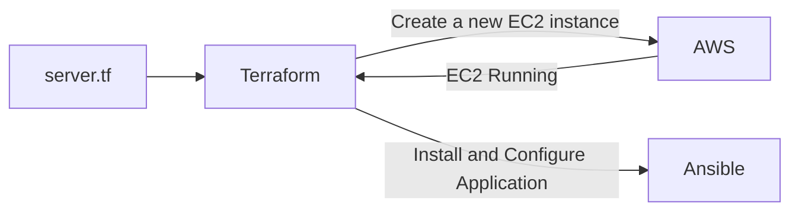

- [IAC and Config Management](#iac-and-config-management)
  - [Exploring IAC Tools](#exploring-iac-tools)
  - [Configuration Management vs Infrastructure Orchestration](#configuration-management-vs-infrastructure-orchestration)
  - [IAC + Configuration Management](#iac--configuration-management)
  - [How to choose?](#how-to-choose)
  - [Terraform Features](#terraform-features)
# IAC and Config Management
## Exploring IAC Tools
- Terraform
- CloudFormation
- Heat
- Ansible
- Saltstack
- Chef, Puppet and others
- Pulumi 

## Configuration Management vs Infrastructure Orchestration
- Ansible, Chef, Puppet are configuration management tools which means that they are primarily designed to install and manage software on existing servers.
- Terraform, Cloudformation are the infrastructure orchestration tools which basically means they can provision the servers and infrastructure by themselves.
- Configuration management tools can do some degree of infrastructure provisioning, but the focus here is that some tools are going to be better fit for certain type of tasks.

## IAC + Configuration Management

- Terraform supports configuration management.

## How to choose?
- Is your infrastructure going to be vendor specific in longer term? Example AWS.
  - Cloud Formation.(Not mandetory)
- Are you planning to have multi-cloud/hybrid cloud based infrastructure?
  - Terraform
- How well does it integrate with configuration management tools?
- Price and Support

## Terraform Features
- Supports multiple platforms, has hundreds of providers
- Simple configuration language and faster learning curve.
- Easy integration with configuration management tools like ansible.
- Easily extensible with the help of plugins.
- Free

