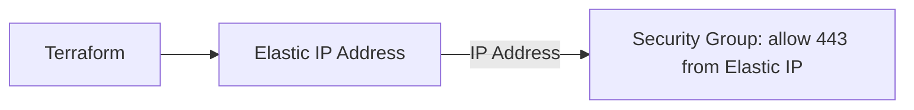
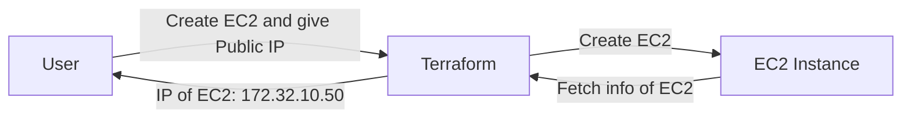
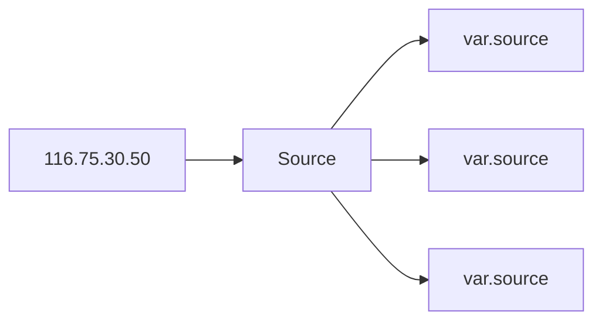
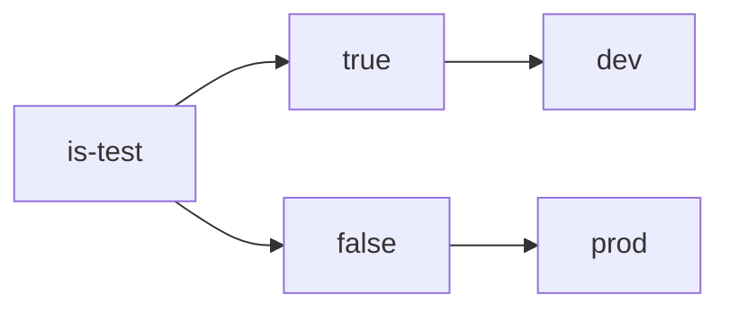
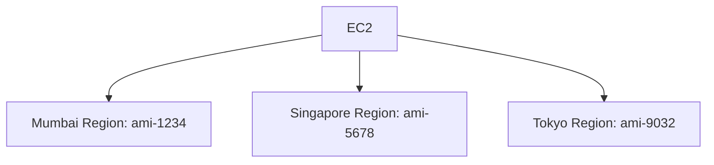

- [Cross Resource Attribute References](#cross-resource-attribute-references)
  - [Basics of attributes](#basics-of-attributes)
  - [Cross Referencing Resource Attribute](#cross-referencing-resource-attribute)
- [Output Values](#output-values)
- [Terraform Variables](#terraform-variables)
  - [Creating a variable](#creating-a-variable)
  - [Referencing variables](#referencing-variables)
- [Approaches to Variable Assignment](#approaches-to-variable-assignment)
  - [Variable default values](#variable-default-values)
  - [Command Line Flags](#command-line-flags)
  - [From a File](#from-a-file)
  - [Environment Variables](#environment-variables)
- [Data Types for Variables](#data-types-for-variables)
  - [Example Use Case](#example-use-case)
  - [Overview of Data Types](#overview-of-data-types)
- [Fetching data from Maps and Lists in Variable](#fetching-data-from-maps-and-lists-in-variable)
  - [Fetch map variable data](#fetch-map-variable-data)
    - [Example](#example)
  - [Fetching list variable data](#fetching-list-variable-data)
    - [Example](#example-1)
- [Count and Count Index](#count-and-count-index)
  - [Count Parameter](#count-parameter)
  - [Count Index](#count-index)
    - [Challenge with Count](#challenge-with-count)
    - [Iteration with count index](#iteration-with-count-index)
    - [Challenge with default count index](#challenge-with-default-count-index)
    - [Count index with lists](#count-index-with-lists)
- [Conditional Expressions](#conditional-expressions)
  - [Example of conditional expression](#example-of-conditional-expression)
- [Local Values](#local-values)
    - [Local Values support for expression](#local-values-support-for-expression)
    - [Important pointers for Local Values](#important-pointers-for-local-values)
- [Terraform Functions](#terraform-functions)
  - [List of available functions](#list-of-available-functions)
  - [terraform console command](#terraform-console-command)
- [Data Sources](#data-sources)
- [Debugging in Terraform](#debugging-in-terraform)
  - [Storing terraform logs](#storing-terraform-logs)
  - [Important points](#important-points)
- [Terraform format](#terraform-format)
- [Terraform Validate](#terraform-validate)
- [Load Order \& Semantics](#load-order--semantics)
  - [Best practices](#best-practices)
  - [Resource local names best practices](#resource-local-names-best-practices)
- [Dynamic Blocks](#dynamic-blocks)
  - [Iterators in Dynamic blocks](#iterators-in-dynamic-blocks)
- [Terraform taint](#terraform-taint)
  - [Recreating the resource](#recreating-the-resource)
- [Splat Expressions](#splat-expressions)
- [Terraform Graph](#terraform-graph)
- [Saving terraform plan to file](#saving-terraform-plan-to-file)
- [Terraform Output](#terraform-output)
- [Terraform Settings](#terraform-settings)
  - [Terraform version setting](#terraform-version-setting)
  - [Proivder setting](#proivder-setting)
- [Dealing with large infrastructure](#dealing-with-large-infrastructure)
    - [Auto approve apply](#auto-approve-apply)
- [Zipmap function in terraform](#zipmap-function-in-terraform)
  - [Use case](#use-case)
- [Comments in Terraform](#comments-in-terraform)
- [Challenges with Count meta argument](#challenges-with-count-meta-argument)
- [Data type: SET](#data-type-set)
  - [TOSET Function](#toset-function)
- [For Each in Terraform](#for-each-in-terraform)
  - [The each object](#the-each-object)
# Cross Resource Attribute References
- It can happen that in a single terraform file, you're defining 2 different resources.
- However Resource 2 might be dependent on some value of Resource 1.
- Example: First create a Elastic IP address and then use the value of IP in Security Group.
  - Elastic IP Should be created before Security Group.


## Basics of attributes
- Each resource has it's associated set of attributes.
- Attributes are the fieds in  a resource that hold the values that end up in state.
- Example: EC2 instance
  - ID, public_ip, private_ip, private_dns
- These attributes are only get available when the resource is created.
- How to find attributes of other terraform resources for reference in other resources?
  - We can see attributes list in the terraform documentation.
## Cross Referencing Resource Attribute
- Terraform allows us to reference the attribute of one resource to be used in a different resource.
  ```hcl
  resource "aws_security_group" "name" {
      name = "allow_tls"
      vpc_id = aws_vpc.main.id
      ingress{
          description = "TLS from VPC"
          from_port = 443
          to_port = 443
          protocol = "tcp"
          cidr_blocks = ["${aws_eip.eip.public_ip}/32"]
      }
  }
  ```
- In above example, we are using attributes of aws_vpc resource and aws_eip resource.
- So there's a dependency here, now security group will only be created after completion of Elastic IP address.

# Output Values
- Output values make information about your infrastructure available on the command line, and can expose information for other terraform configurations to use.


- How to get outputs?
  ```hcl
  output "public_ip_eip" {
      description = "Elastic IP Public IP Address"
      value = aws_eip.eip.public_ip
  }
  ```
- Output values are defined in Project A can be referenced from code in Project B as well.

# Terraform Variables
- Repeated static values can create more work in the future.
- We can have a central source from which we can import the values from to terraform.


## Creating a variable
- Create a file ```variables.tf```
  ```hcl
  variable "vpn_ip" {
    default = "116.30.45.50/32"
  }
  ```
## Referencing variables
```hcl
resource "aws_security_group" "allow_tls" {
  name        = "allow_tls"
  ingress {
    from_port        = 443
    to_port          = 443
    protocol         = "tcp"
    cidr_blocks      = [var.vpn_ip]
  }
}
```

# Approaches to Variable Assignment
- Vairables in terraform can be assigned values in multiple ways.
- Some of these include:
  - Environment Variables
  - Command Line Flags
  - From a File
  - Variable Defaults
## Variable default values
- We can assign a default value to a variable while defining the variable in tf file.
  ```hcl
  variable "instance_type" {
    default = "t3.micro"
  }
  ```
- If no explicit value is defined to terraform then only terraform will use default value. If we don't use default value then terraform will ask us for the value of variable on the command line.
## Command Line Flags
- We can assign variables through the command line in terraform commands
  ```hcl
  terraform plan -var="instance_type=t2.small"
  ```
## From a File
- Assigning multiple variables as command line flags is much hard.
- We can use a variable file called: ```terraform.tfvars```
  - this file must have the extension: ```.tfvars``` or ```.tfvars.json```
  - ```terraform.tfvars``` file is default file that terraform will automatically fetch variables from this file.
  - But if file name is different then we have to pass the variable file path to terraform through CLI.
- We can define variable values in the ```terraform.tfvars``` file like this
  ```hcl
  instance_type = "t2.large"
  ```
- By default terraform will fetch variable values from ```terraform.tfvars``` file if this file exists.
- If we have to explicitly name the ```tfvars``` file then we need to tell terraform that this is a variables file and fetch variables from it.
- Terraform by default only look into the file which has name: ```terraform.tfvars```
- When using custom filename like: ```custom.tfvars```
  ```hcl
  terraform plan -var-file="terraform.tfvars"
  ```
## Environment Variables
- If we want terraform to fetch values of variables from Environment variable.
- We have to set Environment variables in a Specific way by including ```TF_VAR_``` in prefix, like this
```hcl
export TF_VAR_instance_type=t2.micro
```

# Data Types for Variables
- The type argument in a variable block allows you to restrict the type of value that will be accepted as the value for a variable.
```hcl
variable "image_id"{
    type = string
}
```
## Example Use Case
- Every employee in a Corp is assigned a Identification Number.
- Any resource that employee creates should be created with the name of the identification number only.

| variables.tf                              | terraform.tfvars                  |
|-------------------------------------------|-----------------------------------|
| variable "instance_name"{}                | instance_name="john-123"          |
| variable "instance_name"{ type = number } | instance_name = 123               |

## Overview of Data Types
| Type Keywords | Description                                                                             |
|---------------|-----------------------------------------------------------------------------------------|
| string        | sequence of unicode characters representing some text, like "hello"                     |
| list          | sequencial list of values identified by their position. Starts with 0 ["mumbai",delhi"] |
| map           | a group of values identified by named labels, like {name = "Mabel", age = 52}           |
| number        | Example: 200                                                                            |

# Fetching data from Maps and Lists in Variable
- How we can reference values from variables of type map and list?
- Let's say we have this value of a variable of type map
  ```js
  {
        us-east-1 = "t3.micro"
        eu-north-1 = "t3.medium"
        ap-south-1 = "t2.small"
    }
    ```
- Or let's say I've a value of a variable of type list
  ```js
  ["m5.large","t3.micro","t3.medium"]
  ```

## Fetch map variable data
- In map variables, to fetch a specific value of map, we can use the key as reference.
- In maps, values are like key value pairs like this
  ```js
  var1 = {key=value}
  ```
- So if we need to fetch value we can use key like this : ```var1[key]```
### Example
```hcl
resource "aws_iam_user" "lb" {
    name = var.usernumber
    instance_type = var.typesMap[us-east-1]
}
variable "typesMap" {
    type = map
    default = {
        us-east-1 = "t3.micro"
        eu-north-1 = "t3.medium"
        ap-south-1 = "t2.small"
    }
}
```

## Fetching list variable data
- Lists work like list in python, and array in other languages.
- We can reference list values with index keys.
- List index starts from 0
  ```js
     var = ["value1","value2","value3"]
  // index = [0,1,2]
  // var[0] = "value1"
  // var[2] = "value3"
  ```
### Example
```hcl
resource "aws_iam_user" "lb" {
    name = var.usernumber
    instance_type = var.types[1]
}
variable "types" {
    type = list
    default = ["m5.large","t3.micro","t3.medium"] 
}
```

# Count and Count Index
## Count Parameter
- The count parameter on resources can simplify configurations and let you scale resources by simply incrementing a number.
- Let's assume, you need to create 2 EC2 instances. One of the common approach is to define 2 separate resource blocks for aws_instance.
  ```hcl
  resource "aws_instance" "instance-1" {
      ami = "ami-id"
      instance_type = "t3.micro"
  }
  resource "aws_instance" "instance-2" {
      ami = "ami-id"
      instance_type = "t3.micro"
  }
  ```
- So we have to create multiple resource blocks for creating similar multiple resources, but what if we have to create so many of same type resources? It will be a long code and repeating code.
- With count parameter, we can simply specify the count value and the resource can be scaled accordingly. As below example if count = 2, 2 instances will be created.
  - aws_instance.instance-1[0]
  - aws_instance.instance-1[1]
  ```hcl
  resource "aws_instance" "instance-1" {
      ami = "ami-0989fb15ce71ba39e"
      instance_type = "t3.micro"
      count = 2
  }
  ```
## Count Index
- In resource blocks where count is set, an additional count object is available in expressions, so you can modify the configuration of each instance.
- This object has one attribute:
  - ```count.index``` - The distinct index number (starting with 0) corresponding to this instance.
### Challenge with Count
- With the below code, terraform will create 5 IAM users. But the problem is that all will have same name
  ```hcl
  resource "aws_iam_user" "lb"{
    name = "loadbalancer"
    count = 5
    path = "/system/"
  }
  ```
- Apply will fail because of same name in 5 iam users.
- What if we want each resource should have different names or some different configuration.
### Iteration with count index
- ```count.index``` allows us to fetch the index of each iteration in the loop.
  ```hcl
    resource "aws_iam_user" "lb"{
    name = "loadbalancer.${count.index}"
    count = 5
    path = "/system/"
  }
  ```
- Whenever we use count, resource block will run in a loop. And it runs count times.
### Challenge with default count index
- Having a username like loadbalancer0, loadbalancer1 might not always be suitable.
- Better names like dev-loadbalancer, stage-loadbalancer, prod-loadbalancer is better.
### Count index with lists
- ```count.index``` can help in above such scenarios as well.
- We can make use of a list variable.
- And we can do count.index on this list variable.
  ```hcl
  variable "elb_names"{
    type = list
    default = ["dev-loadbalancer","stage-loadbalancer","prod-loadbalancer"]
  }
  ```
- Now we can do iteration on the variable using count.index. like elb_names[count.index]
- Example:
  ```hcl
  resource "aws_iam_user" "lb" {
  name  = var.elb_names[count.index]
  count = 3
  path  = "/system/"
  }
  variable "elb_names"{
    type = list
    default = ["dev-loadbalancer","stage-loadbalancer","prod-loadbalancer"]
  }
  ```
- REMEMBER: Count value should be same as the list variable length.

# Conditional Expressions
- A conditional expression uses the value of a bool expression to select one of two values.
- Syntax of conditional expression:
  ```js
  condition ? true_val : false_val
  ```
- If condition is true then the result is true_val. If the condition is false then the result is false_val
## Example of conditional expression
- Let's assume that there are 2 resource blocks as part of terraform configuration.
- Depending on the variable value, one of the resource blocks will run.
  


```hcl
variable "istest"{
    type = bool
    default = true
}
resource "aws_instance" "instance-dev" {
  ami           = "ami-0989fb15ce71ba39e"
  instance_type = "t3.micro"
  count = var.istest == true ? 1 : 0
}
resource "aws_instance" "instance-prod" {
  ami           = "ami-0989fb15ce71ba39e"
  instance_type = "t3.large"
  count = var.istest == false ? 1 : 0
}
```

# Local Values
- A Local value assigns a name to an expression, allowing it to be used multiple times within a module without repeating it.
```hcl
locals {
  common_tags = {
    Owner = "DevOps Team"
    Service = "backend"
  }
}
resource "aws_instance" "instance-dev" {
  ami           = "ami-0989fb15ce71ba39e"
  instance_type = "t3.micro"
  tags = local.common_tags
}
resource "aws_ebs_volume" "name" {
    availability_zone = "us-west-2a"
    size = 8
    tags = local.common_tags
}
```

### Local Values support for expression
- Local Values can be used for multiple different use-cases like having a conditional expression.
```hcl
locals{
  name_prefix = "${var.name != "" ? var.name : var.default }"
}
```

### Important pointers for Local Values
- Local values can be helpful to avoid repeating the same values or expressions multiple times in a configuration.
- If overused they can also make a configuration hard to read by future maintainers by hiding the actual values used.
- Use local values only in moderation, in situations where a single value or result is used in many places and that value is likely to be changed in future.

# Terraform Functions
- The terraform language includes a number of built-in functions that we can use to transform and combine values.
- The general syntax for function calls is a function name followed by comma-separated arguments in parantheses:
  - ```function(argument1, argument2)```
- Example:
  - ```max(5,12,9)``` > 12

## List of available functions
- The terraform language doesn't support user-defined functions, and so only the functions built in to the language are available for use
  - Numeric
  - String
  - Collection
  - Encoding
  - Filesystem
  - Date and Time
  - Hash and Crypto
  - IP Network
  - Type Conversion
## terraform console command
- using terraform console we can run a terraform executor for our testing for the functions.

# Data Sources
- Data sources allow data to be fetched or computed for use elsewhere in Terraform configuration.
- Let's say we need ami id for creating aws instances, but ami ids differ region to region.


- Data Source Code defined under the data block.
- Reads from a specific data source (aws_ami) and exports results under ```app_ami```

```hcl
data "aws_ami" "app_ami" {
    most_recent = true
    owners = ["amazon"]
    filter{
        name = "name"
        values = ["amzn2-ami-hvm*"]
    }
}
resource "aws_instance" "instance-dev" {
  ami           = data.aws_ami.app_ami.id
  instance_type = "t3.micro"
  tags = local.common_tags
}
```

# Debugging in Terraform
- Terraform has detailed logs which can be enabled by setting the TF_LOG environment variable to any value.
- You can set TF_LOG to one of the log levels to change the verbosity of the logs.
  - TRACE
  - DEBUG
  - INFO
  - WARN
  - ERROR

- To enable debugging we can do like
```hcl
export TF_LOG=TRACE
```

## Storing terraform logs
- To store terraform logs we can use any file to store the logs by setting environment variable
```hcl
export TF_LOG_PATH=/tmp/terraform-crash.log
```
- After setting this environment variable, while terraform plan or apply it will create a file which we given to the environment variable and then it will store all the logs to the file.

## Important points
- TRACE is the most verbose and it is the default if TF_LOG is set to something other than a log level name.
- To persist logged output you can set TF_LOG_PATH in order to force the log to always be appended to a specific file when logging is enabled.

# Terraform format
- Anyone who is into programming knows the importance of formatting the code for readability.
- The terraform fmt command is used to rewrite terraform configuration files to take care of the overall formatting.
- Before formatting
  ```hcl
    data "aws_ami" "app_ami" {
      most_recent = true
    owners = ["amazon"]
      filter{
  name = "name"
        values = ["amzn2-ami-hvm*"]
      }
  }
  ```
- After formatting ```terraform fmt```
  ```hcl
  data "aws_ami" "app_ami" {
    most_recent = true
    owners      = ["amazon"]
    filter {
      name   = "name"
      values = ["amzn2-ami-hvm*"]
    }
  }
  ```

# Terraform Validate
- Terraform validate primarily checks whether a configuration is syntactically valid.
- It can check various aspects including unsupported arguments, undeclared variables and others.
- Example
```hcl
resource "aws_instance" "instance-dev" {
  ami           = data.aws_ami.app_ami.id
  instance_type = "t3.micro"
  sky = "blue"
}
```
- ```terraform validate``` output
```
|
│ Error: Unsupported argument
│ 
│   on main.tf line 15, in resource "aws_instance" "instance-dev":
│   15:   sky = "blue"
│ 
│ An argument named "sky" is not expected here.
╵
```

# Load Order & Semantics
- Terraform generally loads all the configuration files within the directory specified in alphabetical order.
- The files loaded must end in either ```.tf``` or ```.tf.json``` to specify the format that is in use.
## Best practices
- Give proper naming conventions.
- File names like:
  - ec2.tf
  - iam_user.tf
  - variables.tf
  - provider.tf
## Resource local names best practices
- never name resources as same in multiple blocks.

# Dynamic Blocks
- In many of use cases, there're repeatable nested blocks that needs to be defined.
- This can lead to a long code and it can be difficult to manage in a longer time.
- For example in this configuration, we're creating a security group in aws with 2 ingress rules.
  ```hcl
    ingress {
      from_port        = 443
      to_port          = 443
      protocol         = "tcp"
      cidr_blocks      = ["0.0.0.0/0"]
    }
    ingress {
      from_port        = 9200
      to_port          = 9200
      protocol         = "tcp"
      cidr_blocks      = ["0.0.0.0/0"]
    }
  ```
- So basically we're using repeated blocks for defining 2 ingress or let's say we have to define 5-10 ingress then it will lead us to longer code and repeated task.
- Dynamic block allows us to dynamically construct repeatable nested blocks which is supported inside resource, data, provider, and provisioner blocks:
  ```hcl
    dynamic "ingress" {
      for_each = var.ingress_ports
      content {
        from_port = ingress.value
        to_port = ingress.value
        protocol = "tcp"
        cidr_blocks = ["0.0.0.0/0"]
      }
    }
  ```
- And variable ingress_ports can be like this
  ```hcl
  variable "ingress_ports" {
    type = list
    default = [443,9200,80,8080]
  }
  ```

## Iterators in Dynamic blocks
- The iterator argument(optional) sets the name of a temprorary variablel that represents the current element of the complex value.
- If omitted, the name of the variable defaults to the label of the dynamic block ("ingress" in the example)
  ```hcl
    dynamic "ingress" {
      for_each = toset(var.ingress_ports)
      iterator = port
      content {
        from_port = port.value
        to_port = port.value
        protocol = "tcp"
        cidr_blocks = ["0.0.0.0/0"]
      }
    }
  ```

# Terraform taint
- You have created a new resource via Terraform.
- Users have made a lot of manual changes(both infrastructure and inside the server)
- Two ways to deal with this:
  - Import changes to terraform/delete & recreate the resource
## Recreating the resource
- The ```-replace``` option with terraform apply to force terraform to replace an object even though there're no configuration changes that would require it.

```hcl
terraform apply -replace="aws_instance.web"
```

- Similar kind of functionality was achieved using terraform taint command in order versions of Terraform.
- For terraform v0.15.2 and later, hashicorp recommend using the -replace option with terraform apply.

# Splat Expressions
- Splat expressions allows us to get the list of all the attributes
- Let's assume we're creating an aws iam user with 3 count, and want to output arns
  ```hcl
  resource "aws_iam_user" "lb"{
    name = "iamuser.${count.index}"
    count = 3
    path = "/system/"
  }
  output "arns"{
    value = aws_iam_user.lb[*].arn
  }
  ```
- So here is a splat expression, that we providing means, arn attribute will list all users which are being created.

# Terraform Graph
- The terraform graph command is used to generate a visual representation of either a configuration or execution plan.
- The output of terraform graph is in the DOT format, which can easily be converted to an image.
```hcl
terraform graph > graph.dot
```
- Converting dot file to image
- We can use a tool like graphviz.```brew install graphviz```
- Conver dot file into a image file
```hcl
cat graph.dot | dot -Tsvg > graph.svg
```


# Saving terraform plan to file
- The generated terraform plan can be saved to a file.
- This plan can be used with terraform apply to be certain that the changes shown in this plan are applied.
- Example
  ```hcl
  terraform plan -out=PLAN
  ```
- Now we can use the plan file with terraform apply
  ```hcl
  terraform apply PLAN
  ```

# Terraform Output
- The terraform output command is used to extract the value of an output variable from the state file.
  ```hcl
  terraform output iam_names
  ```

# Terraform Settings
- The special terraform configuration configuration block type is used to configure some behaviours of Terraform itself, such as requiring a minimum Terraform version to apply a configuration.
- terraform settings are gathered together into ```terraform``` block.
  ```hcl
  terraform{
    #....
  }
  ```
## Terraform version setting
- The `required_version` setting accepts a version constraint string, which specifies which versions of terraform can be used with your configuration.
- If the running version of Terraform doesn't match the constraints specified, Terraform will produce an error and exit without taking any further actions.
  ```hcl
  terraform{
    required_version = "> 0.12.0"
  }
  ```
## Proivder setting
- The `required_provider` block specifies all of the providers required by the current module, mapping each local provider name to a source address and a version constaint.
  ```hcl
  terraform {
    required_providers {
      github = {
        source  = "integrations/github"
        version = "~> 5.0"
      }
    }
  }
  ```

# Dealing with large infrastructure
- When you have larger infrastructure, you will face issue related to API limits for a provider.
- Switch to smaller configuration where each can be applied independently.
- We can prevent terraform for querying the current state during operations like terraform plan.
  - This can be achieved by ```-refresh=false``` flag
- The target ```-target``` flag can be used to target a specific resource.
  - generally used as a means to operate on isolated portions of very large configurations.
  - ```terraform plan -target=ec2```


### Auto approve apply
- apply terraform configuration without confirmation ask
```hcl
terraform apply -auto-approve
```

# Zipmap function in terraform
- The zipmap function constructs a map from a list of keys and a corresponding list of values.
```hcl
["pineapple","orange","strawberry"]+["yellow","orange","red"]--zipmap-->{"pinapple"="yellow" "orange"="orange" "strawberry"="red"}
```

## Use case
- We're creating multiple IAM users.
- We need output which contains direct mapping of IAM names and ARNs

```hcl
output "arns"{
  value = aws_iam_user.lb[*].arn
}
output "name"{
  value = aws_iam_user.lb[*].name
}
output "combined"{
  value = zipmap(aws_iam_user.lb[*].name,aws_iam_user.lb[*].arn)
}
```

# Comments in Terraform
- A comment is a text note added to the source code to provide explanatory information, usually about the function of the code.
- Terraform language supports three different syntaxes for comments:
  - `#` : begins a single line comment, ending at the end of line
  - `//` : also begins a single-line comment, as an alternative to #
  - `/*` and `*/` : are start and end delimiters for a comment that might span over multiple lines.
```hcl
# this is a coment
```

# Challenges with Count meta argument
- Resources are identified by the index value from the list if we use count.
  ```hcl
  resource "aws_iam_user" "lb" {
    name  = "loadbalancer.${var.elb_names[count.index]}"
    count = 3
    path  = "/system/"
  }
  variable "elb_names"{
      type = list
      default = ["dev-loadbalancer","stage-loadbalancer","prod-loadbalancer"]
  }
  ```
- Resource address will be identified like: ```aws_iam_user.iam[0]```
- Challenge 1:
  - If the order of elements of index is changed, this can impact all of the other resources.
- If your resources are almost identical, count is appropriate.
- If distinctive values are needed in the arguments, usage of `for_each` is recommended.

# Data type: SET
- Lists are used to store multiple items in a single variable.
- List items are ordered, changable, and allow duplicate values.
- List items are indexed, the first item has index[0], the second item has index[1] etc.
- SET is used to store multiple items in a single variable.
- SET iems are unordered and no duplicates are allowed.
  ```hcl
  demoset = {"apple","banana","mango","apple"} # NOT ALLOWED
  ```
## TOSET Function
- `toset` function will convert the list variable to set.
- It will remove duplicates also.
  - `toset(["a","b","b","c"])`
  - Output: 
  ```
  [
      "a",
      "b",
      "c",
    ]
  ```

# For Each in Terraform
- `for_each` makes use of map/set as an index value of the created resource.
- Creating 3 IAM users.
```hcl
resource "aws_iam_user" "lb" {
  for_each = toset(var.elb_names)
  name     = each.key
  path     = "/system/"
}
variable "elb_names" {
  type    = list(any)
  default = ["dev-loadbalancer", "stage-loadbalancer", "prod-loadbalancer"]
}
```
- If a new element is added, it will not affect the other resources.
- `for_each` iteratable by key and value as it uses map or set.
```hcl
resource "aws_instance" "instance-dev" {
  for_each = {
    "key1" = "t2.micro"
    "key2" = "t3.medium"
  }
  ami           = data.aws_ami.app_ami.id
  instance_type = each.value
  key_name = each.key
}
```

## The each object
- In blocks where `for_each` is set, an additional each object is available.
- This object has two attributes:
  - `each.key`: The map(or set member) corrsponding to this instance.
  - `each.value`: The map value corresponding to this instance.

---