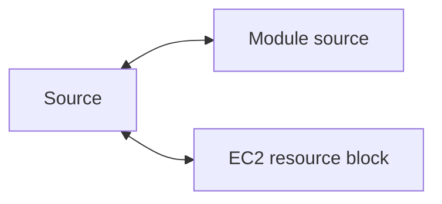

- [Understanding DRY Principle](#understanding-dry-principle)
  - [Centralized Structure](#centralized-structure)
- [Implementing EC2 using Modules](#implementing-ec2-using-modules)
  - [Directory Structure](#directory-structure)
  - [Module](#module)
  - [Calling Module](#calling-module)
- [Variables and Terraform Modules](#variables-and-terraform-modules)
  - [Module definition with variables](#module-definition-with-variables)
  - [Calling modules with variables](#calling-modules-with-variables)
- [Using locals with Modules](#using-locals-with-modules)
  - [Setting the context](#setting-the-context)
  - [Using locals in modules for repetitive arguments](#using-locals-in-modules-for-repetitive-arguments)
- [Referencing Module Outputs](#referencing-module-outputs)
  - [Accessing Child Module Outputs](#accessing-child-module-outputs)
- [Terraform Registry](#terraform-registry)
  - [Verified Modules in Terraform registry](#verified-modules-in-terraform-registry)
  - [Using Terraform registry modules in Terraform](#using-terraform-registry-modules-in-terraform)
  - [Create EC2 instance from registry module](#create-ec2-instance-from-registry-module)
  - [Where modules in registry stored?](#where-modules-in-registry-stored)
- [Requirements for Publishing modules into Terraform registry](#requirements-for-publishing-modules-into-terraform-registry)
  - [Standard Module Structure](#standard-module-structure)
- [Terraform Workspace](#terraform-workspace)
- [Implementing Terraform workspace](#implementing-terraform-workspace)
  - [Directory structure using workspaces](#directory-structure-using-workspaces)
# Understanding DRY Principle
- In software engineering, don't repeat yourself(DRY) is a principle of software development aimed at reducing repetition of software patterns.
- In earlier, we were making static content into variables so that there can be single source of information.
- We do repeat multiple times various terraform resources for multiple projects.
- Sample EC2 resource
  ```hcl
  resource "aws_instance" "myec2" {
      ami = "ami-0989fb15ce71ba39e"
      instance_type = "t3.micro"
      security_groups = ["default"]
  }
  ```

## Centralized Structure
- We can centralize the terraform resources and can call out from TF Files whenever required.


# Implementing EC2 using Modules
## Directory Structure
```sh
|Main
     |- Modules
                |- ec2/
                       |- Main.tf
                       |- Variables.tf
     |- Projects
                |- A/
                     |- ec2.tf
```

## Module
- `modules/ec2/mod_ec2.tf`
```hcl
provider "aws" {
    region = "eu-north-1"
}
resource "aws_instance" "myweb" {
    ami = "ami"
    instance_type = "t3.micro"
}
```

## Calling Module
- `Projects/A/ec2_web.tf`
```hcl
module "myec2" {
    source = "../../modules/ec2"
}
```

# Variables and Terraform Modules
- One common need on infrastructure management is to build environments like staging, production with similar setup but keeping environment variables different.
```sh
development: instance_type = t2.micro
staging: instance_type = t2.small
production: instance_type = m4.large
```
- When we use modules directly, the resources will be replica of code in the module.

## Module definition with variables

- `modules/ec2/mod_ec2.tf`
```hcl
provider "aws" {
    region = "eu-north-1"
}
resource "aws_instance" "myweb" {
    ami = "ami"
    instance_type = var.instance_type
}
variable "instance_type" {
    type = string
    default = "t3.micro"
}
```

## Calling modules with variables
```hcl
module "myec2" {
    source = "../../modules/ec2"
    instance_type = "t3.medium"
}
```

# Using locals with Modules
- Using variables in modules can also allow users to override the values which you might not want.
## Setting the context
- There can be many repetitive values in modules and this can make your code difficult to maintain.
- We can centralize these using variables but users will be able to override it.
- Hardcoding ports in ingress 
  ```hcl
  resource "aws_security_group" "allow_tls" {
    name        = "allow_tls"
    ingress {
      from_port        = 443
      to_port          = 443
      protocol         = "tcp"
      cidr_blocks      = ["0.0.0.0/0"]
    }
  }
  ```
- Making use of variables for ports
  ```hcl
  resource "aws_security_group" "allow_tls" {
    name        = "allow_tls"
    ingress {
      from_port        = var.app_port
      to_port          = var.app_port
      protocol         = "tcp"
      cidr_blocks      = ["0.0.0.0/0"]
    }
  }
  ```
- But in this also users will be able to override it.
- What we want to not specify repetitive values but not using variables.

## Using locals in modules for repetitive arguments
- Create a new module folder called `sg` for security group module.
- Create 2 security groups in the sg module
```hcl
provider "aws" {
  region = "eu-north-1"
}
resource "aws_security_group" "ec2-sg" {
  name        = "myec2-sg"
  ingress {
    from_port        = 8443
    to_port          = 8443
    protocol         = "tcp"
    cidr_blocks      = ["0.0.0.0/0"]
  }
  egress {
    from_port        = 0
    to_port          = 0
    protocol         = "-1"
    cidr_blocks      = ["0.0.0.0/0"]
    ipv6_cidr_blocks = ["::/0"]
  }
}
resource "aws_security_group" "elb-sg" {
  name        = "elb-sg"
  ingress {
    from_port        = 8443
    to_port          = 8443
    protocol         = "tcp"
    cidr_blocks      = ["0.0.0.0/0"]
  }
  egress {
    from_port        = 0
    to_port          = 0
    protocol         = "-1"
    cidr_blocks      = ["0.0.0.0/0"]
    ipv6_cidr_blocks = ["::/0"]
  }
}
```
- Call this module in the Project B folder in `my-sg.tf` file
```hcl
module "sgmodule" {
    source = "../../modules/sg"
}
```

- Now if we see the module code, there's much repetitive work in the module.(ports)
- Easiest way to prevent repetitive work, we can use variables for ports.
- But users can override the port values while calling the module like this:
```hcl
module "sgmodule" {
    source = "../../modules/sg"
    app_port = "22"
}
```

- So the risk is much more higher, because if user change it will be overridden.
- We need an approach where we can make this port like a variable so that it will not be repetitive but also users can change it intentionally or accidentally.
- We can do this using locals
- Instead of variables, we can make use of locals to assign the values.
- We can centralize these using variables but suers will be able to override it.
- [x] Using Locals
```hcl
provider "aws" {
  region = "eu-north-1"
}
locals {
  app_port = 8444
}
resource "aws_security_group" "ec2-sg" {
  name = "myec2-sg"
  ingress {
    from_port   = local.app_port
    to_port     = local.app_port
    protocol    = "tcp"
    cidr_blocks = ["0.0.0.0/0"]
  }
  egress {
    from_port        = 0
    to_port          = 0
    protocol         = "-1"
    cidr_blocks      = ["0.0.0.0/0"]
    ipv6_cidr_blocks = ["::/0"]
  }
}
resource "aws_security_group" "elb-sg" {
  name = "elb-sg"
  ingress {
    from_port   = local.app_port
    to_port     = local.app_port
    protocol    = "tcp"
    cidr_blocks = ["0.0.0.0/0"]
  }
  egress {
    from_port        = 0
    to_port          = 0
    protocol         = "-1"
    cidr_blocks      = ["0.0.0.0/0"]
    ipv6_cidr_blocks = ["::/0"]
  }
}
```

# Referencing Module Outputs
- Output values make information about your infrastructure available on the command line and can expose information for other Terraform configuration to use.
```hcl
output "instance_ip_addr"{
  value = aws_instance.server.private_ip
}
```

## Accessing Child Module Outputs
- In a parent module, outputs of child modules are available in expressions as module.
  - `<MODULE NAME>.<OUTPUT NAME>`
- Example module: Security group
```hcl
locals {
  app_port = 8444
}
resource "aws_security_group" "ec2-sg" {
  name = "myec2-sg"
  ingress {
    from_port   = local.app_port
    to_port     = local.app_port
    protocol    = "tcp"
    cidr_blocks = ["0.0.0.0/0"]
  }
  egress {
    from_port        = 0
    to_port          = 0
    protocol         = "-1"
    cidr_blocks      = ["0.0.0.0/0"]
    ipv6_cidr_blocks = ["::/0"]
  }
}
output "sg_id" {
    value = aws_security_group.ec2-sg.arn
}
```
- Reference the module output in the project 
```hcl
module "sgmodule" {
    source = "../../modules/sg"
}
resource "aws_instance" "web" {
    ami = "ami_id"
    instance_type = "t3.micro"
    vpc_security_group_ids = [module.sgmodule.sg_id]
}
```

- If we want output on the CLI then we need to define the output in the root module file also.

# Terraform Registry
- The terraform registry is a repository of modules written by the terraform community.
- The registry can help us to get started with  terraform more quickly.
## Verified Modules in Terraform registry
- Within terraform registry, we can find verified modules that are maintained by various third party vendors.
- These modules are available for various resources like AWS VPC, RDS, ELB and others.
- Verified modules are reviewed by Hashicorp and actively maintained by contributors to stay up-to-date and compatible with both terraform and their respective providers.
- The blue verification badge appears next to modules that are verified(Same like you purchase blue tick on twitter and instagram but here you can't purchase it's hashicorp who verify)
- Module verification is currently a manual process restricted to a small group of trusted Hashicorp partners.

## Using Terraform registry modules in Terraform
- To use Terraform registry module within the code, we can make use of the source argument that contains the module path.
- Below code references to the EC2 Instance module within terraform registry.
```hcl
module "ec2-instance"{
  source = "terraform-aws-modules/ec-instance/aws"
  version = "2.13.0"
  # insert the 10 required variables here
}
```

## Create EC2 instance from registry module
- Define the code 
```hcl
provider "aws" {
    region = "eu-north-1"
  
}
module "ec2-instance" {
  source = "terraform-aws-modules/ec2-instance/aws"
  name   = "single-instance"


  instance_type = "t3.micro"
  subnet_id     = "subnet-eddcdzz4"

  tags = {
    Terraform   = "true"
    Environment = "dev"
  }
}
```
- Run `terraform init`
  - It will download the provider and the module now inside the `.terraform` directory.
- Then Run `terraform apply`.
## Where modules in registry stored?
- On Github
- We can check the source code of the registry modules.

# Requirements for Publishing modules into Terraform registry
- How can we publish the module to a registry?
- Anyone can publish and share modules on the terraform registry.
- Published modules support versioning, automatically generate documentation, allow browsing version histories, show examples and READMEs and more.

| Requirement               | Description                                                                                                                                               |
|---------------------------|-----------------------------------------------------------------------------------------------------------------------------------------------------------|
| Github                    | The module must be on Github on public repo. This is only a requirement for the public registry.                                                          |
| Named                     | Module repositories must use this three-part name format terraform-<PROVIDER>-<NAME>                                                                      |
| Repository Description    | The github repo description is used to populate the short description of the module.                                                                      |
| Standard Module Structure | The module must adhere to the standard module structure.                                                                                                  |
| x.y.z tags for release    | The registry uses tags to identify module versions. Release tag names must be semantic version, which can optionally be prefixed with a v. For ex: v1.0.4 |


## Standard Module Structure
- The standard module structure is a file and directory layout that is recommended for reusable modules distributed in separate repositories.
- Minimal Module
```sh
├── README.md
├── main.tf
├── outputs.tf
└── variables.tf
```
- Complete Module
```sh
├── README.md
├── examples
│   ├── exampleA
│   │   └── main.tf
│   └── exampleB
├── main.tf
├── modules
│   ├── nestedA
│   │   ├── README.md
│   │   ├── main.tf
│   │   ├── outputs.tf
│   │   └── variables.tf
│   └── nestedB
├── outputs.tf
└── variables.tf
```

# Terraform Workspace
- Terraform allows us to have multiple workspaces, with each of the workspace we can have different set of environment variables associated.
  - Development
  - Production

- Command: `terraform workspace`
  - Usage: terraform [global options] workspace
  - new, list, show, select and delete Terraform workspaces.
  - Subcommands:
    - `delete`:    Delete a workspace
    - `list`:      List Workspaces
    - `new`:       Create a new workspace
    - `select`:    Select a workspace
    - `show`:      Show the name of the current workspace
- Check current workspace
  ```sh
  terraform workspace show
  ```

# Implementing Terraform workspace
- Let's say we have a terraform configuration for ec2 instance as below
```hcl
provider "aws" {
    region = "eu-north-1"
}
data "aws_ami" "app_ami" {
    most_recent = true
    owners = ["amazon"]
    filter{
        name = "name"
        values = ["amzn2-ami-hvm*"]
    }
}
resource "aws_instance" "instance-dev" {
  ami           = data.aws_ami.app_ami.id
  instance_type = "t3.micro"
}
```

- Now here instance type is by default hard coded as t3.micro
- But we want is
  - default workspace: t3.nano
  - dev workspace: t3.micro
  - prod workspace: t3.medium

- First of all check workspaces 
  - ```terraform workspace list```
  - ```terraform workspace show```
- It's just default now. Create a new workspace
  - `terraform workspace new dev`
- List workspaces now and check current workspace
  - `terraform workspace list`
  - `terraform workspace show`
  - Now current workspace is dev because we created it, terraform set it to current.
- Create a new workspace now
  - `terraform workspace new prod`
- Depending on the workspace, we want the instance type to change. We can make use of map as well as function.
- Create a map first
  ```hcl
  variable "instance_type" {
      type = map
      default = {
          default = "t3.nano"
          dev = "t3.micro"
          prod = "t3.large"
      }
  }
  ```
- Now we have to change the instance type based on the workspace.
  ```hcl
  provider "aws" {
      region = "eu-north-1"
  }
  data "aws_ami" "app_ami" {
      most_recent = true
      owners = ["amazon"]
      filter{
          name = "name"
          values = ["amzn2-ami-hvm*"]
      }
  }
  resource "aws_instance" "instance-dev" {
    ami           = data.aws_ami.app_ami.id
    instance_type = lookup(var.instanec_type,terraform.workspace)
  }
  variable "instance_type" {
      type = map
      default = {
          default = "t3.nano"
          dev = "t3.micro"
          prod = "t3.large"
      }
  }
  ```

- Now using this approach we can make use of terraform workspace.
## Directory structure using workspaces
- Now if we see the directory structure in our project, where we used workspaces.
```sh
├── .terraform
│   ├── environment
│   └── providers
│       └── registry.terraform.io
│           └── hashicorp
│               └── aws
│                   └── 5.7.0
│                       └── darwin_arm64
│                           └── terraform-provider-aws_v5.7.0_x5
├── .terraform.lock.hcl
├── main.tf
└── terraform.tfstate.d
    ├── dev
    └── prod
```
- There're 2 folders now
  - `.terraform`
  - `terraform.tfstate.d`
- `terraform.tfstate.d` is a new folder here.
- In workspace, terraform maintains state file separately for each workspace.
- So here in this folder terraform maintaing the state files in separate folders for the each workspace.
- 