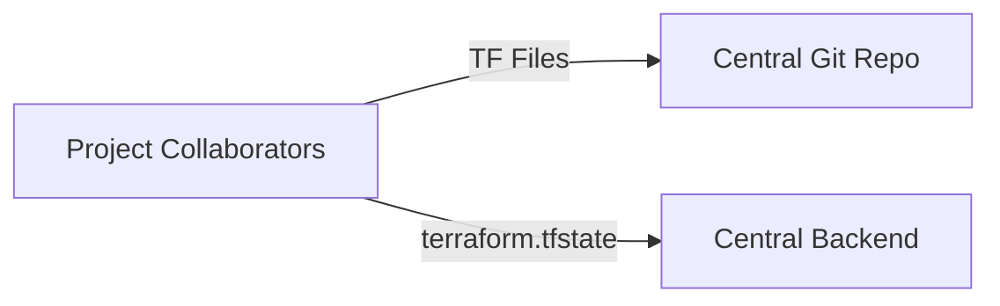
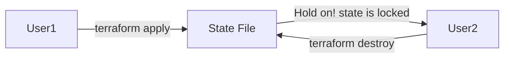
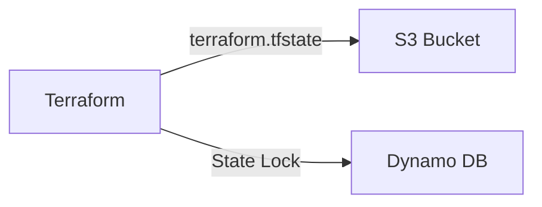
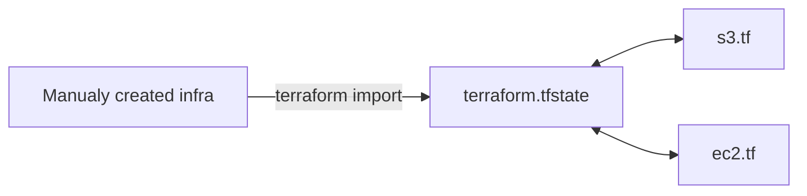

- [Git for Team Collaboration](#git-for-team-collaboration)
- [Security Challenges in Committing TFState in Git](#security-challenges-in-committing-tfstate-in-git)
- [Module Sources in Terraform](#module-sources-in-terraform)
  - [Supported Module Sources](#supported-module-sources)
  - [Local Path](#local-path)
  - [Git Module Source](#git-module-source)
    - [Referencing to a Branch](#referencing-to-a-branch)
- [Terraform and .gitignore](#terraform-and-gitignore)
- [Terraform Backends](#terraform-backends)
  - [Basics of backend](#basics-of-backend)
  - [Challenges with storing state on local](#challenges-with-storing-state-on-local)
  - [Ideal Architecture](#ideal-architecture)
  - [Backends supported in terraform](#backends-supported-in-terraform)
  - [Important Note](#important-note)
- [Implementing S3 backend](#implementing-s3-backend)
- [State file locking](#state-file-locking)
  - [Force unlocking state](#force-unlocking-state)
- [State locking in S3 with dynamoDB integration](#state-locking-in-s3-with-dynamodb-integration)
- [Terraform State Management](#terraform-state-management)
    - [Terraform state list command](#terraform-state-list-command)
    - [Terraform state mv command](#terraform-state-mv-command)
    - [Terraform state pull command](#terraform-state-pull-command)
    - [Terraform state push command](#terraform-state-push-command)
    - [Terraform state rm command](#terraform-state-rm-command)
    - [Terraform state show command](#terraform-state-show-command)
- [Cross project collaboration with remote state](#cross-project-collaboration-with-remote-state)
- [Terraform Import](#terraform-import)
  - [Earlier Approach](#earlier-approach)
  - [Newer approach](#newer-approach)
  - [Points to Note](#points-to-note)
# Git for Team Collaboration
- Currently we've been working with terraform code locally.
- If multiple collaborators need to work on the same terraform code, then we need a central repository to store our terraform code.
- We can use any git repository for storing our terraform code.

# Security Challenges in Committing TFState in Git
- Our terraform  scripts contains passwords and sensitive data but we should not store the sensitive information in terraform scripts  in a git repo.
- Instead of storing password, we can use functions like fetching password from files, encrypted secrets, or env variables.
- But state file actually will store the actual password.
- If we commit state file `terraform.tfstate` into the git repository, state file will also have sensitive information.
- So we should not store terraform state file in the git repo.

# Module Sources in Terraform
## Supported Module Sources
- The source argument in a module block tells terraform where to find the source code for the desired child module.
- Local Paths
- Terraform Registry
- GitHub
- Bitbucket
- Generic Git, Mercurial repositories
- HTTP URLs
- S3 Buckets
- GCS Buckets
## Local Path
- A Local path must begin with either `./` or `../` to indicate that a local path is intended.
```hcl
module "consul"{
    source = "../consul"
}
```
## Git Module Source
- Arbitary Git repositories can be used by prefixing the address with the special `git::` prefix
- After the prefix, any valid Git URL can be specified to select one of the protocols supported by Git.
```hcl
module "vpc"{
    source = "git::https://github.com/tush-tr/vpc.git"
}
module "storage"{
    source = "git::ssh://username@example.com/storage.git"
}
```
### Referencing to a Branch
- By default, terraform will clone and use the default branch(referenced by HEAD) in the selected repository.
- You can override this using the ref argument:
  ```hcl
  module "vpc"{
    source = "git::https://github.com/tush-tr/vpc.git?ref=v1.2.0"
  }
  ```
- The value of ref argument can be any reference that would be accepted by the git checkout command, including branch and tag names.

# Terraform and .gitignore
- The `.gitignore` file is a text file that tells Git which files or folders to ignore in a project.
- Depending on the environments, it is recommended to avoid committing certain files to GIT.
- `.terraform`
  - This file will be recreated when terraform init is run.
- `terraform.tfvars`
  - Likely to contain sensitive data like username/passwords and secrets.
- `terraform.tfstate`
  - Should be stored in a remote state
- `crash.log`
  - If terraform crashes, the logs are stored to a file named `crash.log`

```sh
# Local .terraform directories
**/.terraform/*

# .tfstate files
*.tfstate
*.tfstate.*

# Crash log files
crash.log
crash.*.log

# Exclude all .tfvars files, which are likely to contain sensitive data, such as
# password, private keys, and other secrets. These should not be part of version 
# control as they are data points which are potentially sensitive and subject 
# to change depending on the environment.
*.tfvars
*.tfvars.json

# Ignore override files as they are usually used to override resources locally and so
# are not checked in
override.tf
override.tf.json
*_override.tf
*_override.tf.json

# Include override files you do wish to add to version control using negated pattern
# !example_override.tf

# Include tfplan files to ignore the plan output of command: terraform plan -out=tfplan
# example: *tfplan*

# Ignore CLI configuration files
.terraformrc
terraform.rc
```

# Terraform Backends
## Basics of backend
- Backends primarily determine where terraform stores it's state.
- By default, terraform implicitly uses a backend called local to store state as a local file on disk.
## Challenges with storing state on local
- Nowadays terraform project is handled and collaborated by an entire team.
- Storing the state file in the local laptop will now allow collaboration.
## Ideal Architecture
- The terraform code is stored in Git repository.
- The state file is stored in a central backend.


## Backends supported in terraform
- Terraform supports multiple backends that allow remote service related operations.
  - S3
  - Consul
  - Azurerm
  - Kubernetes
  - HTTP
  - ETCD
  - GCS
  - artifactory
  - oss
  - pg
  - manta
  - swift
- Each backend will require it's own set of configurations.


## Important Note
- Accessing state in a remote service generally requires some kind of access credentials.
- Some backends act like plain "remote disks" for state files; others support locking the state while operations are being performed, which helps prevent conflicts and inconsistencies.


# Implementing S3 backend
- First create a bucket in S3.
- Create a terrraform `backend.tf` or we can add backend config in existing file also.
  ```hcl
  terraform {
    backend "s3" {
      bucket = "my-terrform-state-bucket"
      key = "path/to/my/key"
      region = "eu-north-1"
    }
  }
  ```

# State file locking
- Whenever you're performing write operation, terraform would lock the state file.
- This is very important as otherwise during your ongoing terraform apply operations, if others also try for the same, it can corrupt the state file.



- through `.terraform.tfstate.lock.info` file terraform will know that there's a ongoing operation, and it locks the state.
- State locking hapens automatically on all operations that could write state. You won't see any message that it is happening
- If state locking fails, terraform will not continue.
- Not all backends support locking. The documentation for each backend includes details on whether it supports locking or not.

## Force unlocking state
- Terraform has a `force-unlock` command to manually unlock the state if unlocking failed.
- If you unlock the state when someone else is holding the lock it could cause multiple writers.
- Force unlock should only be used to unlock your own lock in the situation where automatic unlocking failed.

# State locking in S3 with dynamoDB integration
- By Default, S3 doesn't support state locking functionality.
- You need to make use of DynamoDB table to archieve state locking functionality.


- Write terraform config file for using s3 backend
```hcl
terraform {
  backend "s3" {
    bucket = "my-terraform-state-bucket-1234"
    key = "tmp.tfstate"
    region = "eu-north-1"
  }
}
resource "time_sleep" "wait_150_seconds" {
    create_duration = "150s"
}
```

- Create dynamodb table
  - Partition key: `LockID` type of string
- Specify table name in terraform settings

```hcl
terraform {
  backend "s3" {
    bucket = "my-terraform-state-bucket-1234"
    key = "tmp.tfstate"
    region = "eu-north-1"
    dynamodb_table = "terraform-state-locking"
  }
}
```

- Now state locking will be done with dynamoDB table. LockID will be stored in dynamoDB table.

# Terraform State Management
- As your terraform usage become more advanced, thre are some cases where you may need to modify terraform state.
- It is important to never modify the state file directly. Instead, make use of terraform state command.
- `terraform state` command
  - `list`: List resources within terraform state file
  - `mv`: Moves item with terraform state.
  - `pull`: Manually download and output the state from remote state.
  - `push`: Manually upload a local state file to remote state.
  - `rm`: Remove items from the terraform state.
  - `show`: Show the attributes of a single resource in the state.

### Terraform state list command
- The terraform state list command is used to list resources within a terraform state.
### Terraform state mv command
- The `terraform state mv` command is used to move items in a terraform state.
- This command is used in many cases in which you want to rename an existing resource without destroying and recreating it.
- Due to the destructive nature of this command, this command will output a backup copy of the state prior to saving any changes.
- Overall Syntax
  ```sh
  terraform state mv [Options] SOURCE DESTINATION
  ```
### Terraform state pull command
- The `terraform state pull` command is used to manually download and output the state from remote state.
- This is useful for reaidng values out of state(potentially pairing this command with something like jq)
### Terraform state push command
- The  `terraform state push` command is used to manually upload a local state file to remote state.
- This command should rarely be used.
### Terraform state rm command
- The `terraform state rm` command is used to remove items from the terraform state.
- Items removed from the terraform state are not physically destroyed.
- Items removed from the terraform state are only no longer managed by Terraform.
- For ex: If you remove an AWS instance from the state, the AWS instance will continue running, but terraform plan will no longer see that instance.
### Terraform state show command
- The  `terraform state show` command is used to show the attributes of a single resource in the terraform state.

# Cross project collaboration with remote state
- The `terraform_remote_state` data source retrieves the root module output values from some other Terraform configuration, using the latest state snapshot from the remote backend.
```hcl
data "terraform_remote_state" "eip" {
  backend = "s3"
  config = {
    bucket = "my-terrform-state-bucket"
    key    = "demo.tfstate"
    region = "eu-north-1"
  }
}
resource "aws_security_group" "name" {
    name = "allow_tls"
    ingress{
        from_port = 443
        to_port = 443
        protocol = "tcp"
        cidr_blocks = ["${data.terraform_remote_state.eip.outputs.eip_addr}/32"]
    }
}
```

# Terraform Import
- It can happen that all the resources in an organization are created manually.
- Organization now wants to start using terraform and manage these resources via Terraform.
## Earlier Approach
- In the older approach, terraform import would create the state file associated with the resources running in your environment.
- Users still had to write the tf files from scratch.



## Newer approach
- In the newer approach, terraform import can automatically create the terraform configuration files for the resources you want to import.
```hcl
provider "aws" {
    region = "eu-north-1"
}
import {
    to = aws_s3_bucket.mystatebucket
    id = "my-terraform-state-bucket-1234"
}
```

- Run terraform plan 
```sh
terraform plan -generate-config-out=mybucket.tf
```

- Resource file will be generated by terraform.
- Now when we apply then infrastructure will be imported to tf state.

## Points to Note
- terraform 1.5 introduces automatic code generation for imported resources.
- This dramatically reduces the amount of time you need to spend writing code to match the imported.
- This feature is not available in the older version of Terraform.
```sh
terraform version
```


