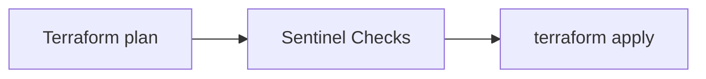
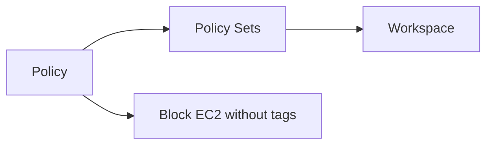
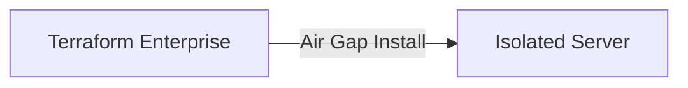

- [Overview of Terraform Cloud](#overview-of-terraform-cloud)
- [Creating Terraform Cloud Account](#creating-terraform-cloud-account)
- [Creating infra with terraform cloud](#creating-infra-with-terraform-cloud)
- [Sentinel](#sentinel)
  - [High Level Structure](#high-level-structure)
- [Remote Backends](#remote-backends)
  - [Remote operations](#remote-operations)
  - [Builtin cloud integration](#builtin-cloud-integration)
- [Air Gapped Environments](#air-gapped-environments)
  - [Concept of Air Gap](#concept-of-air-gap)
  - [Terraform Enterprise Installation methods](#terraform-enterprise-installation-methods)
# Overview of Terraform Cloud
- Terraform cloud manages terraform runs in a consistent and reliable environment with various features like access controls, private registry for sharing modules, policy controls and others.

# Creating Terraform Cloud Account
- First create a free account.
- Main components on the console
  - Organization
  - Workspace
  - Registry (For modules)
  - Settings
- Create new workspace
  - Select type
    - Version control workflow
    - CLI-driven workflow
    - API-driver workflow
  - Connect to VCS 
    - Github
    - Gitlab
    - Bitbucket
    - Azure Devops
  - Choose repository

# Creating infra with terraform cloud
- Create a new workspace(verion control workflow)
- Add your terraform config files to a github repo and connect the repo to it.
- Specify environment variables(for aws authentication)
- Trigger plan and apply using the console.

# Sentinel
- Sentinel is a policy-as-code framework integrated with the hashicorp enterprise products.
- It enables fine-granted, logic-based policy decisions, and can be extended to use information from external sources.
- NOTE: Sentinel policies are paid feature.


## High Level Structure


# Remote Backends
- The remote backend stores terraform state and may be used to run operations in terraform cloud.
- Terraform cloud can also be used with local operations, in which case only state is stored in the terraform cloud backend.
## Remote operations
- When using full remote operations, operations like terraform plan or terraform apply can be executed in terraform cloud's run environment, with log output streaming to the local terminal.

- Create a file `backend.hcl`
```hcl
workspaces { name = "demo-repo" }
hostname = "app.terraform.io"
organization = "demo-tushar-org"
```

- Terraform configuration
```hcl
terraform {
    required_version = "~> 0.12.0"
    backend "remote" {}
}
resource "aws_iam_user" "lb"{
    name = "remoteuser"
    path = "/system/"
}
```

## Builtin cloud integration
```hcl
terraform {
    cloud {
        organization = "example-org"
        hostname = "app.terraform.io"
        workspaces{
            tags = ["app"]
        }
    }
}
```

# Air Gapped Environments
## Concept of Air Gap
- An Air gap is a network security measure employed to ensure that a secure computer network is physically isolated from unsecured networks, such as the public internet.
- Physically isolated resources with it's own router by internal router.
- Generally used in various areas.
  - Military/governmental computer networks/system
  - Financial computer systems, such as stock exchanges
  - Industrial control systems, such as SCADA in Oil & Gas Fields.

## Terraform Enterprise Installation methods
- Terraform enterprise installs using either an online or air gapped method and as the names infer, one requires internet connectivity, the other does not.


